# Архитектура взаимодействия и оркестрации агентов

## Ключевой механизм: динамический список доступных агентов

> **Важно:** DispatcherAgent при каждом вызове LLM динамически формирует system prompt со списком **только доступных** агентов из [`AgentRegistry`](src/nergal/dialog/base.py:252). Это позволяет модели составлять планы только из тех агентов, которые реально зарегистрированы в системе.

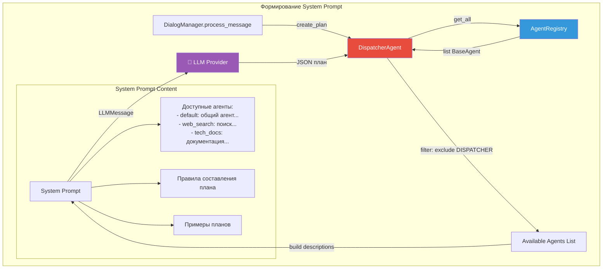

### Код формирования списка агентов

```python
# dispatcher_agent.py:120-191
def _build_system_prompt(self) -> str:
    # Получаем список доступных агентов из реестра
    available_agents = self._get_available_agents()
    
    # Строим описание каждого агента
    agent_list = []
    for agent_type in available_agents:
        description = AGENT_DESCRIPTIONS.get(agent_type, f"агент типа {agent_type.value}")
        agent_list.append(f"- {agent_type.value}: {description}")
    
    agents_text = "\n".join(agent_list)
    
    # Формируем prompt с актуальным списком агентов
    prompt = f"""Ты — диспетчер-планировщик...
    
Доступные агенты:
{agents_text}

Твоя задача:
1. Проанализировать сообщение пользователя
2. Составить план выполнения из этих агентов
3. Указать каких агентов не хватает для идеального выполнения
..."""
    return prompt

def _get_available_agents(self) -> list[AgentType]:
    if self._agent_registry is None:
        return [AgentType.DEFAULT, AgentType.WEB_SEARCH]
    
    agents = []
    for agent in self._agent_registry.get_all():
        # Исключаем dispatcher чтобы избежать бесконечного цикла
        if agent.agent_type != AgentType.DISPATCHER:
            agents.append(agent.agent_type)
    
    # Всегда включаем default как fallback
    if AgentType.DEFAULT not in agents:
        agents.insert(0, AgentType.DEFAULT)
    
    return agents
```

### Преимущества динамического подхода

1. **Гибкость** — можно добавлять/удалять агентов без изменения кода планировщика
2. **Точность** — модель видит только реально доступные агенты
3. **Обратная связь** — модель может указать каких агентов не хватает (`missing_agents`)
4. **Изоляция** — dispatcher исключает сам себя из списка чтобы избежать рекурсии

---

## Общая схема системы

```mermaid
graph TB
    subgraph "Внешний слой"
        User[👤 Пользователь]
        Telegram[📱 Telegram Bot API]
    end

    subgraph "Точка входа"
        Main[🚀 main.py<br/>Telegram Bot Handler]
    end

    subgraph "Ядро диалоговой системы"
        DialogManager[📋 DialogManager<br/>Координатор системы]
        ContextManager[🗃️ ContextManager<br/>Управление контекстами]
        AgentRegistry[📚 AgentRegistry<br/>Реестр агентов]
    end

    subgraph "Планировщик"
        Dispatcher[🎯 DispatcherAgent<br/>Анализ и планирование]
    end

    subgraph "Агенты сбора информации"
        WebSearch[🔍 WebSearchAgent<br/>Поиск в интернете]
        KnowledgeBase[📖 KnowledgeBaseAgent<br/>База знаний]
        TechDocs[📘 TechDocsAgent<br/>Тех. документация]
        CodeAnalysis[💻 CodeAnalysisAgent<br/>Анализ кода]
        Metrics[📊 MetricsAgent<br/>Метрики]
        News[📰 NewsAgent<br/>Агрегация новостей]
    end

    subgraph "Агенты обработки"
        Analysis[🔬 AnalysisAgent<br/>Анализ данных]
        FactCheck[✅ FactCheckAgent<br/>Проверка фактов]
        Comparison[⚖️ ComparisonAgent<br/>Сравнение]
        Summary[📝 SummaryAgent<br/>Резюмирование]
        Clarification[❓ ClarificationAgent<br/>Уточнение]
    end

    subgraph "Специализированные агенты"
        Expertise[🎓 ExpertiseAgent<br/>Экспертные знания]
        Default[💬 DefaultAgent<br/>Общение и финальный ответ]
    end

    subgraph "Система памяти"
        MemoryService[🧠 MemoryService<br/>Управление памятью]
        ExtractionService[📝 MemoryExtractionService<br/>Извлечение фактов]
        Database[(🗄️ PostgreSQL<br/>Хранилище)]
    end

    subgraph "LLM Provider"
        LLM[🤖 LLM Provider<br/>ZAI/OpenAI/и т.д.]
    end

    %% Основной поток
    User -->|Сообщение| Telegram
    Telegram -->|Webhook/Update| Main
    Main -->|process_message| DialogManager
    
    %% Dialog Manager связи
    DialogManager -->|get_or_create_context| ContextManager
    DialogManager -->|get/register agents| AgentRegistry
    DialogManager -->|create_plan| Dispatcher
    DialogManager -->|memory_context| MemoryService
    
    %% Memory Service связи
    MemoryService -->|persist| Database
    MemoryService -->|extract_facts| ExtractionService
    
    %% Dispatcher связи
    Dispatcher -->|get_available_agents| AgentRegistry
    Dispatcher -->|ExecutionPlan| DialogManager
    
    %% Выполнение плана
    DialogManager -->|execute_step| WebSearch
    DialogManager -->|execute_step| KnowledgeBase
    DialogManager -->|execute_step| TechDocs
    DialogManager -->|execute_step| CodeAnalysis
    DialogManager -->|execute_step| Metrics
    DialogManager -->|execute_step| News
    DialogManager -->|execute_step| Analysis
    DialogManager -->|execute_step| FactCheck
    DialogManager -->|execute_step| Comparison
    DialogManager -->|execute_step| Summary
    DialogManager -->|execute_step| Clarification
    DialogManager -->|execute_step| Expertise
    DialogManager -->|execute_step| Default
    
    %% Агенты используют LLM
    WebSearch -->|generate| LLM
    KnowledgeBase -->|generate| LLM
    TechDocs -->|generate| LLM
    CodeAnalysis -->|generate| LLM
    Metrics -->|generate| LLM
    News -->|generate| LLM
    Analysis -->|generate| LLM
    FactCheck -->|generate| LLM
    Comparison -->|generate| LLM
    Summary -->|generate| LLM
    Clarification -->|generate| LLM
    Expertise -->|generate| LLM
    Default -->|generate| LLM
    Dispatcher -->|generate| LLM

    %% Ответ пользователю
    DialogManager -->|ProcessResult| Main
    Main -->|send_message| Telegram
    Telegram -->|Response| User

    style DialogManager fill:#4a90d9,color:#fff
    style Dispatcher fill:#e74c3c,color:#fff
    style Default fill:#2ecc71,color:#fff
    style LLM fill:#9b59b6,color:#fff
    style MemoryService fill:#f39c12,color:#fff
    style Database fill:#34495e,color:#fff
```

## Поток обработки сообщения

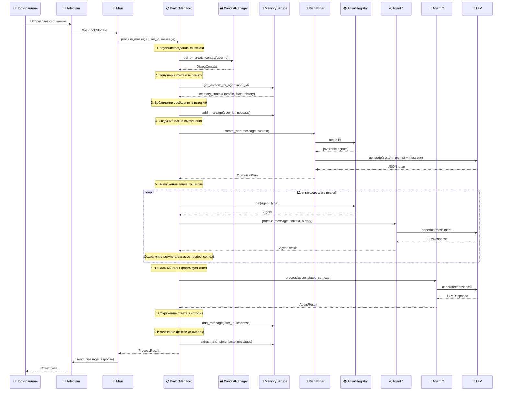

## Структура ExecutionPlan

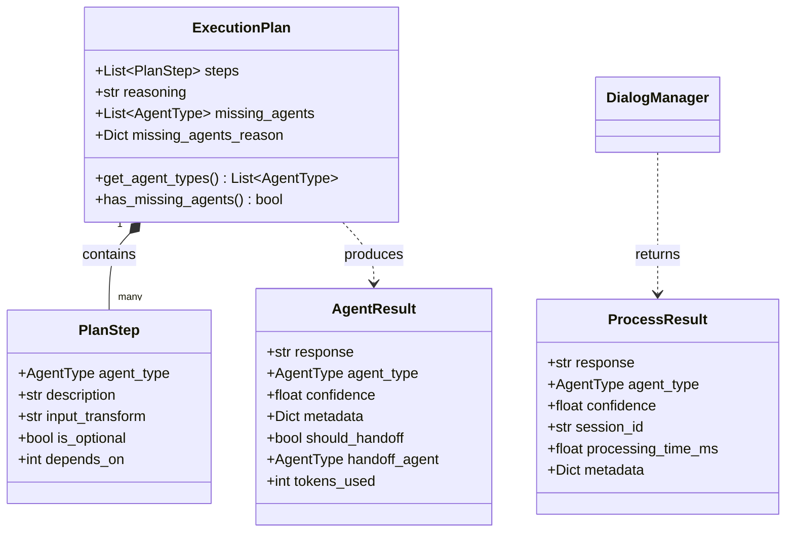

## Категории агентов

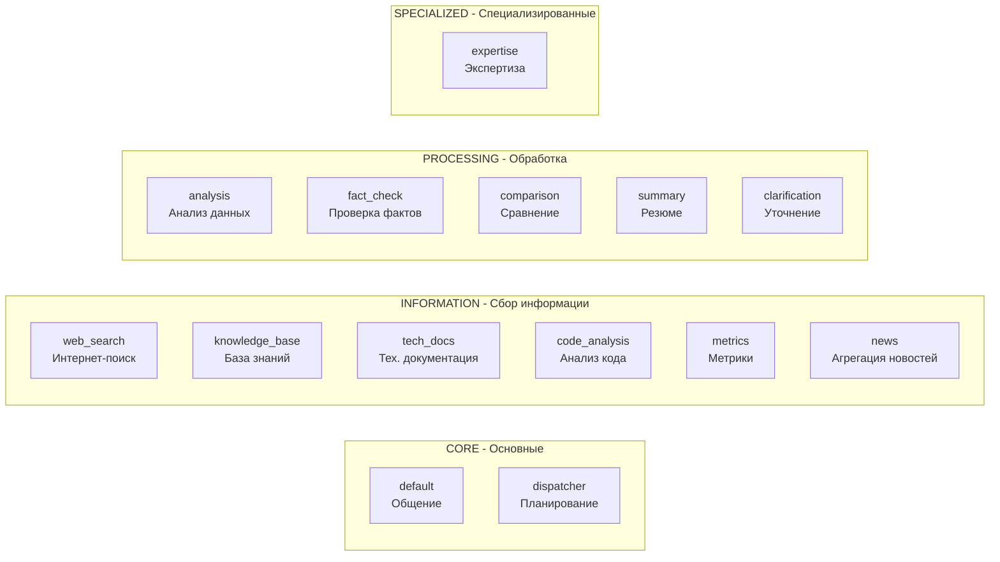

## Примеры планов выполнения

### Пример 1: Простое приветствие
```json
{
    "steps": [
        {"agent": "default", "description": "ответить на приветствие"}
    ],
    "reasoning": "простое приветствие не требует дополнительных агентов"
}
```

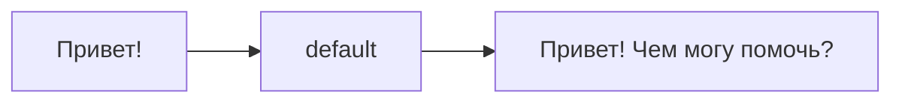

### Пример 2: Поиск актуальной информации
```json
{
    "steps": [
        {"agent": "web_search", "description": "найти актуальную информацию"},
        {"agent": "fact_check", "description": "проверить достоверность", "is_optional": true},
        {"agent": "default", "description": "сформировать ответ"}
    ],
    "reasoning": "для ответа нужен поиск, проверка и формирование ответа"
}
```

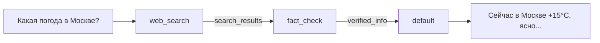

### Пример 3: Сравнение технологий
```json
{
    "steps": [
        {"agent": "web_search", "description": "найти информацию о технологиях"},
        {"agent": "tech_docs", "description": "получить детали из документации"},
        {"agent": "comparison", "description": "сравнить альтернативы"},
        {"agent": "default", "description": "сформировать итоговый ответ"}
    ],
    "reasoning": "для сравнения нужен поиск, документация и анализ"
}
```

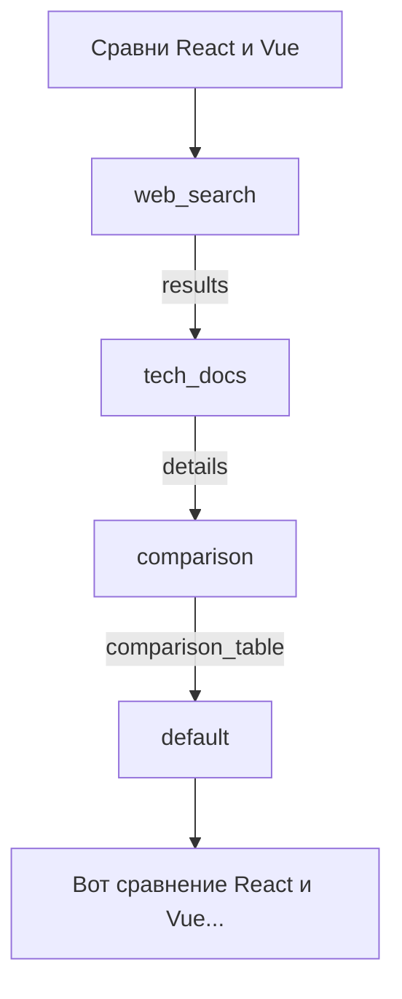

### Пример 4: Агрегация новостей
```json
{
    "steps": [
        {"agent": "web_search", "description": "найти новости по теме"},
        {"agent": "news", "description": "агрегировать и сравнить источники"},
        {"agent": "fact_check", "description": "проверить достоверность", "is_optional": true},
        {"agent": "default", "description": "сформировать итоговый обзор"}
    ],
    "reasoning": "для обзора новостей нужен поиск, агрегация источников и проверка фактов"
}
```

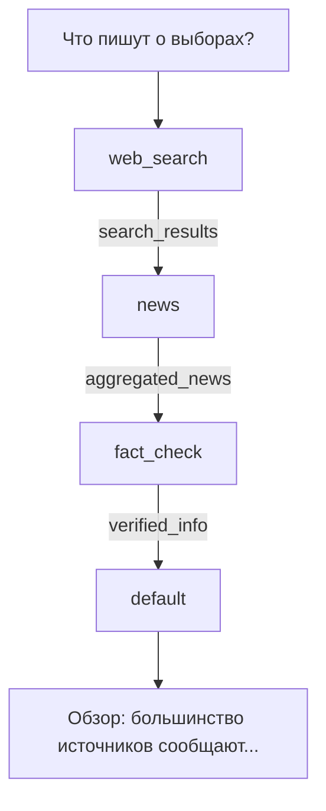

## Система памяти

### Архитектура памяти

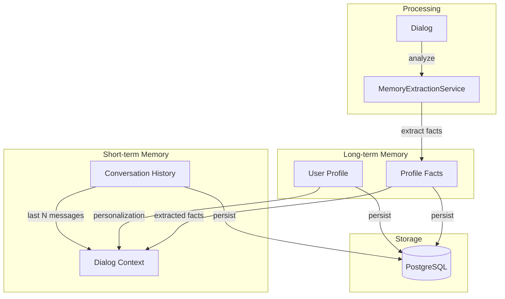

### Компоненты системы памяти

| Компонент | Файл | Описание |
|-----------|------|----------|
| [`MemoryService`](src/nergal/memory/service.py:30) | memory/service.py | Главная точка координации памяти |
| [`MemoryExtractionService`](src/nergal/memory/extraction.py) | memory/extraction.py | Извлечение фактов из диалогов |
| [`UserRepository`](src/nergal/database/repositories.py) | database/repositories.py | Репозиторий пользователей |
| [`ProfileRepository`](src/nergal/database/repositories.py) | database/repositories.py | Репозиторий профилей |
| [`ConversationRepository`](src/nergal/database/repositories.py) | database/repositories.py | Репозиторий диалогов |

### Контекст памяти для агентов

```python
# Пример контекста, передаваемого агентам
memory_context = {
    "user_id": 123456789,
    "user_name": "Иван Петров",
    "user_display_name": "Иван",
    "profile_summary": "Пользователь интересуется Python и ML",
    "conversation_summary": "Последние 5 сообщений о разработке",
    "profile": {...},  # Полный профиль
    "facts": [...],    # Извлеченные факты
    "recent_messages": [
        {"role": "user", "content": "..."},
        {"role": "assistant", "content": "..."}
    ],
    "session_id": "abc123"
}
```

## Жизненный цикл контекста

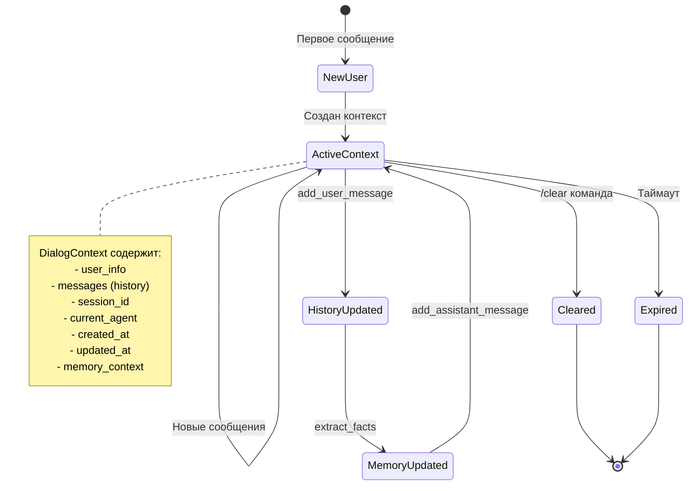

## Взаимодействие компонентов при ошибке

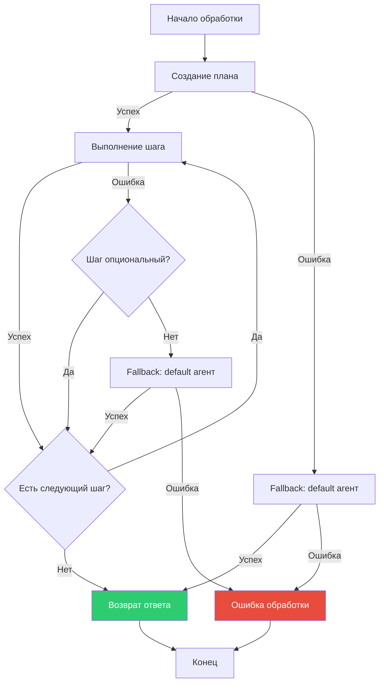

## Ключевые классы и их ответственность

| Класс | Файл | Ответственность |
|-------|------|-----------------|
| [`DialogManager`](src/nergal/dialog/manager.py:56) | manager.py | Главная точка координации, управление контекстом, выполнение планов |
| [`DispatcherAgent`](src/nergal/dialog/dispatcher_agent.py:87) | dispatcher_agent.py | Анализ сообщений, создание планов выполнения |
| [`AgentRegistry`](src/nergal/dialog/base.py:252) | base.py | Хранение и поиск агентов |
| [`ContextManager`](src/nergal/dialog/context.py) | context.py | Управление контекстами пользователей |
| [`BaseAgent`](src/nergal/dialog/base.py:145) | base.py | Абстрактный базовый класс для всех агентов |
| [`ExecutionPlan`](src/nergal/dialog/base.py:104) | base.py | Структура плана выполнения |
| [`PlanStep`](src/nergal/dialog/base.py:85) | base.py | Отдельный шаг в плане |
| [`MemoryService`](src/nergal/memory/service.py:30) | memory/service.py | Управление памятью пользователей |
| [`MemoryExtractionService`](src/nergal/memory/extraction.py) | memory/extraction.py | Извлечение фактов из диалогов |

## Конфигурация системы

```python
# Пример инициализации
from nergal.config import get_settings
from nergal.llm import create_llm_provider
from nergal.dialog.manager import DialogManager
from nergal.memory.service import MemoryService
from nergal.database.connection import get_database

settings = get_settings()

# Инициализация компонентов
llm_provider = create_llm_provider(
    provider_type=settings.llm.provider,
    api_key=settings.llm.api_key,
    model=settings.llm.model,
)

memory_service = MemoryService(db=get_database())

dialog_manager = DialogManager(
    llm_provider=llm_provider,
    max_history=20,
    max_contexts=1000,
    style_type=settings.style,
    use_dispatcher=True,
    memory_service=memory_service,
)

# Регистрация дополнительных агентов
from nergal.dialog.agents import (
    WebSearchAgent,
    KnowledgeBaseAgent,
    TechDocsAgent,
    NewsAgent,
)

dialog_manager.register_agent(WebSearchAgent(llm_provider, settings.style))
dialog_manager.register_agent(KnowledgeBaseAgent(llm_provider, settings.style))
dialog_manager.register_agent(TechDocsAgent(llm_provider, settings.style))
dialog_manager.register_agent(NewsAgent(llm_provider, settings.style))
# ... и т.д.
```

## Структура проекта

```
src/nergal/
├── config.py                    # Конфигурация (pydantic-settings)
├── main.py                      # Точка входа, логика бота
├── exceptions.py                # Исключения
├── auth.py                      # Авторизация пользователей
├── database/
│   ├── connection.py            # Подключение к БД
│   ├── models.py                # SQLAlchemy модели
│   └── repositories.py          # Репозитории для работы с БД
├── dialog/
│   ├── __init__.py              # Публичный API модуля
│   ├── base.py                  # Базовые классы агентов
│   ├── constants.py             # Константы и промпты
│   ├── context.py               # Контекст диалога
│   ├── default_agent.py         # DefaultAgent
│   ├── dispatcher_agent.py      # DispatcherAgent
│   ├── manager.py               # DialogManager
│   ├── styles.py                # Стили ответов
│   ├── agent_loader.py          # Загрузка агентов по конфигурации
│   └── agents/                  # Специализированные агенты
│       ├── __init__.py
│       ├── base_specialized.py  # Базовый класс для спец. агентов
│       ├── web_search_agent.py  # Веб-поиск
│       ├── knowledge_base_agent.py
│       ├── tech_docs_agent.py
│       ├── code_analysis_agent.py
│       ├── metrics_agent.py
│       ├── news_agent.py
│       ├── analysis_agent.py
│       ├── fact_check_agent.py
│       ├── comparison_agent.py
│       ├── summary_agent.py
│       ├── clarification_agent.py
│       └── expertise_agent.py
├── llm/                         # LLM провайдеры
│   ├── __init__.py
│   ├── base.py                  # Базовый класс
│   ├── factory.py               # Фабрика провайдеров
│   └── providers/
│       └── zai.py               # Z.ai реализация
├── memory/                      # Система памяти
│   ├── __init__.py
│   ├── service.py               # MemoryService
│   └── extraction.py            # Извлечение фактов
├── monitoring/                  # Мониторинг
│   ├── __init__.py
│   ├── health.py                # Health checks
│   ├── logging_config.py        # Конфигурация логирования
│   └── metrics.py               # Prometheus метрики
├── admin/                       # Admin веб-панель
│   ├── __init__.py
│   └── server.py                # Flask сервер управления пользователями
├── stt/                         # Speech-to-Text
│   ├── __init__.py
│   ├── base.py
│   ├── factory.py
│   ├── audio_utils.py           # Конвертация аудио
│   └── providers/
│       └── local_whisper.py
├── utils/
│   └── markdown_to_telegram.py
└── web_search/                  # Веб-поиск
    ├── __init__.py
    ├── base.py
    └── zai_mcp_http.py          # MCP HTTP провайдер
```
