# Архитектура взаимодействия и оркестрации агентов

## Обзор текущей реализации

> **Актуально на:** Февраль 2026  
> **Версия:** Соответствует кодовой базе с [`TodoistAgent`](src/nergal/dialog/agents/todoist_agent.py:55) и [`NewsAgent`](src/nergal/dialog/agents/news_agent.py)

### Реестр агентов

В системе реализовано **14 агентов**, разделённых на 4 категории:

| Категория | Агенты | Количество |
|-----------|--------|------------|
| CORE | `default`, `dispatcher` | 2 |
| INFORMATION | `web_search`, `knowledge_base`, `tech_docs`, `code_analysis`, `metrics`, `news` | 6 |
| PROCESSING | `analysis`, `fact_check`, `comparison`, `summary`, `clarification` | 5 |
| SPECIALIZED | `expertise`, `todoist` | 2 |

---

## Ключевой механизм: динамический список доступных агентов

> **Важно:** [`DispatcherAgent`](src/nergal/dialog/dispatcher_agent.py:88) при каждом вызове LLM динамически формирует system prompt со списком **только доступных** агентов из [`AgentRegistry`](src/nergal/dialog/base.py:253). Это позволяет модели составлять планы только из тех агентов, которые реально зарегистрированы в системе.

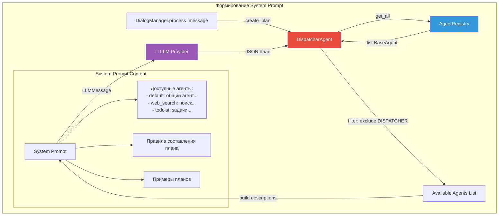
```mermaid
flowchart TD
    subgraph "Формирование System Prompt"
        DM[DialogManager.process_message] -->|create_plan| DA[DispatcherAgent]
        DA -->|get_all| AR[AgentRegistry]
        AR -->|list BaseAgent| DA
        DA -->|filter: exclude DISPATCHER| AVA[Available Agents List]
        AVA -->|build descriptions| SP[System Prompt]
        
        subgraph "System Prompt Content"
            SP --> AGENTS["Доступные агенты:\n- default: общий агент...\n- web_search: поиск...\n- todoist: задачи..."]
            SP --> RULES["Правила составления плана"]
            SP --> EXAMPLES["Примеры планов"]
        end
        
        SP -->|LLMMessage| LLM[🤖 LLM Provider]
        LLM -->|JSON план| DA
    end
    
    style DA fill:#e74c3c,color:#fff
    style AR fill:#3498db,color:#fff
    style LLM fill:#9b59b6,color:#fff
```

### Код формирования списка агентов

```python
# dispatcher_agent.py:172-192
def _get_available_agents(self) -> list[AgentType]:
    """Get list of available agent types from registry."""
    if self._agent_registry is None:
        # Default agents if no registry
        return [AgentType.DEFAULT, AgentType.WEB_SEARCH]

    agents = []
    for agent in self._agent_registry.get_all():
        # Skip dispatcher itself to avoid infinite loop
        if agent.agent_type != AgentType.DISPATCHER:
            agents.append(agent.agent_type)

    # Always include default as fallback
    if AgentType.DEFAULT not in agents:
        agents.insert(0, AgentType.DEFAULT)

    return agents
```

### Преимущества динамического подхода

1. **Гибкость** — можно добавлять/удалять агентов без изменения кода планировщика
2. **Точность** — модель видит только реально доступные агенты
3. **Обратная связь** — модель может указать каких агентов не хватает (`missing_agents`)
4. **Изоляция** — dispatcher исключает сам себя из списка чтобы избежать рекурсии

---

## Общая схема системы


```mermaid
graph TB
    subgraph "Внешний слой"
        User[👤 Пользователь]
        Telegram[📱 Telegram Bot API]
    end

    subgraph "Точка входа"
        Main[🚀 main.py<br/>Telegram Bot Handler]
    end

    subgraph "Ядро диалоговой системы"
        DialogManager[📋 DialogManager<br/>Координатор системы]
        ContextManager[🗃️ ContextManager<br/>Управление контекстами]
        AgentRegistry[📚 AgentRegistry<br/>Реестр агентов]
    end

    subgraph "Планировщик"
        Dispatcher[🎯 DispatcherAgent<br/>Анализ и планирование]
    end

    subgraph "Агенты сбора информации"
        WebSearch[🔍 WebSearchAgent<br/>Поиск в интернете]
        KnowledgeBase[📖 KnowledgeBaseAgent<br/>База знаний]
        TechDocs[📘 TechDocsAgent<br/>Тех. документация]
        CodeAnalysis[💻 CodeAnalysisAgent<br/>Анализ кода]
        Metrics[📊 MetricsAgent<br/>Метрики]
        News[📰 NewsAgent<br/>Агрегация новостей]
    end

    subgraph "Агенты обработки"
        Analysis[🔬 AnalysisAgent<br/>Анализ данных]
        FactCheck[✅ FactCheckAgent<br/>Проверка фактов]
        Comparison[⚖️ ComparisonAgent<br/>Сравнение]
        Summary[📝 SummaryAgent<br/>Резюмирование]
        Clarification[❓ ClarificationAgent<br/>Уточнение]
    end

    subgraph "Специализированные агенты"
        Expertise[🎓 ExpertiseAgent<br/>Экспертные знания]
        Todoist[📋 TodoistAgent<br/>Управление задачами]
        Default[💬 DefaultAgent<br/>Общение и финальный ответ]
    end

    subgraph "Система памяти"
        MemoryService[🧠 MemoryService<br/>Управление памятью]
        ExtractionService[📝 MemoryExtractionService<br/>Извлечение фактов]
        Database[(🗄️ PostgreSQL<br/>Хранилище)]
    end

    subgraph "LLM Provider"
        LLM[🤖 LLM Provider<br/>ZAI/OpenAI/и т.д.]
    end

    %% Основной поток
    User -->|Сообщение| Telegram
    Telegram -->|Webhook/Update| Main
    Main -->|process_message| DialogManager
    
    %% Dialog Manager связи
    DialogManager -->|get_or_create_context| ContextManager
    DialogManager -->|get/register agents| AgentRegistry
    DialogManager -->|create_plan| Dispatcher
    DialogManager -->|memory_context| MemoryService
    
    %% Memory Service связи
    MemoryService -->|persist| Database
    MemoryService -->|extract_facts| ExtractionService
    
    %% Dispatcher связи
    Dispatcher -->|get_available_agents| AgentRegistry
    Dispatcher -->|ExecutionPlan| DialogManager
    
    %% Выполнение плана
    DialogManager -->|execute_step| WebSearch
    DialogManager -->|execute_step| KnowledgeBase
    DialogManager -->|execute_step| TechDocs
    DialogManager -->|execute_step| CodeAnalysis
    DialogManager -->|execute_step| Metrics
    DialogManager -->|execute_step| News
    DialogManager -->|execute_step| Analysis
    DialogManager -->|execute_step| FactCheck
    DialogManager -->|execute_step| Comparison
    DialogManager -->|execute_step| Summary
    DialogManager -->|execute_step| Clarification
    DialogManager -->|execute_step| Expertise
    DialogManager -->|execute_step| Todoist
    DialogManager -->|execute_step| Default
    
    %% Агенты используют LLM
    WebSearch -->|generate| LLM
    KnowledgeBase -->|generate| LLM
    TechDocs -->|generate| LLM
    CodeAnalysis -->|generate| LLM
    Metrics -->|generate| LLM
    News -->|generate| LLM
    Analysis -->|generate| LLM
    FactCheck -->|generate| LLM
    Comparison -->|generate| LLM
    Summary -->|generate| LLM
    Clarification -->|generate| LLM
    Expertise -->|generate| LLM
    Todoist -->|generate| LLM
    Default -->|generate| LLM
    Dispatcher -->|generate| LLM

    %% Ответ пользователю
    DialogManager -->|ProcessResult| Main
    Main -->|send_message| Telegram
    Telegram -->|Response| User

    style DialogManager fill:#4a90d9,color:#fff
    style Dispatcher fill:#e74c3c,color:#fff
    style Default fill:#2ecc71,color:#fff
    style Todoist fill:#e74c3c,color:#fff
    style LLM fill:#9b59b6,color:#fff
    style MemoryService fill:#f39c12,color:#fff
    style Database fill:#34495e,color:#fff
```

---

## Архитектура базовых классов

### Иерархия классов агентов

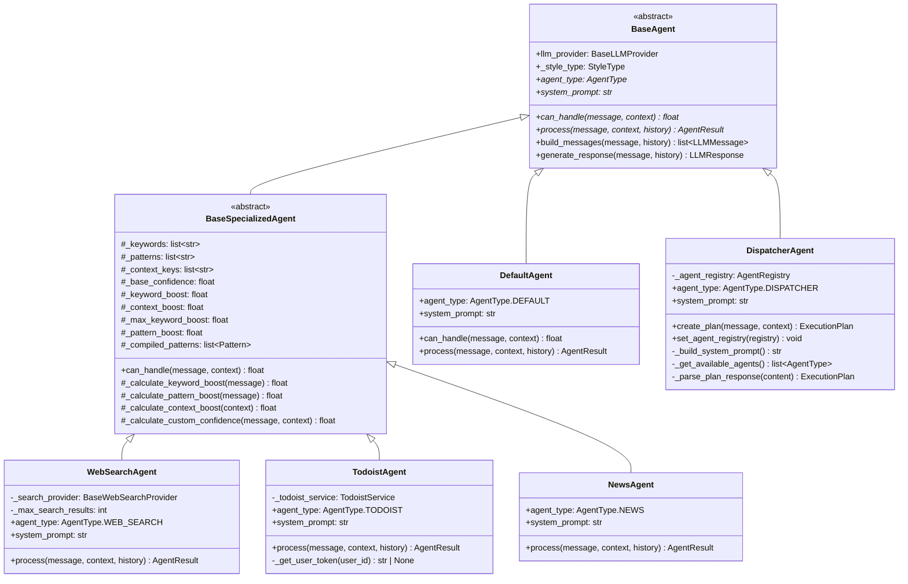
```mermaid
classDiagram
    class BaseAgent {
        <<abstract>>
        +llm_provider: BaseLLMProvider
        +_style_type: StyleType
        +agent_type: AgentType*
        +system_prompt: str*
        +can_handle(message, context) float*
        +process(message, context, history) AgentResult*
        +build_messages(message, history) list~LLMMessage~
        +generate_response(message, history) LLMResponse
    }
    
    class BaseSpecializedAgent {
        <<abstract>>
        #_keywords: list~str~
        #_patterns: list~str~
        #_context_keys: list~str~
        #_base_confidence: float
        #_keyword_boost: float
        #_context_boost: float
        #_max_keyword_boost: float
        #_pattern_boost: float
        #_compiled_patterns: list~Pattern~
        +can_handle(message, context) float
        #_calculate_keyword_boost(message) float
        #_calculate_pattern_boost(message) float
        #_calculate_context_boost(context) float
        #_calculate_custom_confidence(message, context) float
    }
    
    class DefaultAgent {
        +agent_type: AgentType.DEFAULT
        +system_prompt: str
        +can_handle(message, context) float
        +process(message, context, history) AgentResult
    }
    
    class DispatcherAgent {
        -_agent_registry: AgentRegistry
        +agent_type: AgentType.DISPATCHER
        +system_prompt: str
        +create_plan(message, context) ExecutionPlan
        +set_agent_registry(registry) void
        -_build_system_prompt() str
        -_get_available_agents() list~AgentType~
        -_parse_plan_response(content) ExecutionPlan
    }
    
    class WebSearchAgent {
        -_search_provider: BaseWebSearchProvider
        -_max_search_results: int
        +agent_type: AgentType.WEB_SEARCH
        +system_prompt: str
        +process(message, context, history) AgentResult
    }
    
    class TodoistAgent {
        -_todoist_service: TodoistService
        +agent_type: AgentType.TODOIST
        +system_prompt: str
        +process(message, context, history) AgentResult
        -_get_user_token(user_id) str | None
    }
    
    class NewsAgent {
        +agent_type: AgentType.NEWS
        +system_prompt: str
        +process(message, context, history) AgentResult
    }
    
    BaseAgent <|-- BaseSpecializedAgent
    BaseAgent <|-- DefaultAgent
    BaseAgent <|-- DispatcherAgent
    BaseSpecializedAgent <|-- WebSearchAgent
    BaseSpecializedAgent <|-- TodoistAgent
    BaseSpecializedAgent <|-- NewsAgent
```

### Template Method Pattern в BaseSpecializedAgent

Класс [`BaseSpecializedAgent`](src/nergal/dialog/agents/base_specialized.py:20) использует паттерн Template Method для определения confidence:

```python
# base_specialized.py:99-130
async def can_handle(self, message: str, context: dict[str, Any]) -> float:
    """Determine confidence using Template Method pattern."""
    confidence = self._base_confidence
    
    # 1. Keyword boost
    keyword_boost = await self._calculate_keyword_boost(message)
    confidence += min(keyword_boost, self._max_keyword_boost)
    
    # 2. Pattern boost
    pattern_boost = await self._calculate_pattern_boost(message)
    confidence += pattern_boost
    
    # 3. Context boost
    context_boost = await self._calculate_context_boost(context)
    confidence += context_boost
    
    # 4. Custom hook for agent-specific logic
    custom_boost = await self._calculate_custom_confidence(message, context)
    confidence += custom_boost
    
    return min(confidence, 1.0)
```

---

## Конфигурация агентов

### AgentSettings в config.py

Агенты настраиваются через переменные окружения с префиксом `AGENTS_`:

```python
# config.py:203-253
class AgentSettings(BaseSettings):
    """Agent registration settings."""
    
    model_config = SettingsConfigDict(
        env_prefix="AGENTS_",
        env_file=".env",
        env_file_encoding="utf-8",
        extra="ignore",
    )

    # Information gathering agents
    web_search_enabled: bool = Field(default=True, description="Enable WebSearchAgent")
    news_enabled: bool = Field(default=False, description="Enable NewsAgent")
    knowledge_base_enabled: bool = Field(default=False, description="Enable KnowledgeBaseAgent")
    tech_docs_enabled: bool = Field(default=False, description="Enable TechDocsAgent")
    code_analysis_enabled: bool = Field(default=False, description="Enable CodeAnalysisAgent")
    metrics_enabled: bool = Field(default=False, description="Enable MetricsAgent")
    
    # Processing agents
    analysis_enabled: bool = Field(default=False, description="Enable AnalysisAgent")
    fact_check_enabled: bool = Field(default=False, description="Enable FactCheckAgent")
    comparison_enabled: bool = Field(default=False, description="Enable ComparisonAgent")
    summary_enabled: bool = Field(default=False, description="Enable SummaryAgent")
    clarification_enabled: bool = Field(default=False, description="Enable ClarificationAgent")
    
    # Specialized agents
    expertise_enabled: bool = Field(default=False, description="Enable ExpertiseAgent")
    todoist_enabled: bool = Field(default=True, description="Enable TodoistAgent")
```

### Регистрация агентов через agent_loader

```python
# agent_loader.py:301-495
def register_configured_agents(
    registry: "AgentRegistry",
    settings: Settings,
    llm_provider: "BaseLLMProvider",
    search_provider: "BaseWebSearchProvider | None" = None,
) -> list[str]:
    """Register agents based on configuration settings."""
    registered = []
    agent_settings = settings.agents
    style_type = settings.style
    
    # WebSearchAgent - requires search_provider
    if agent_settings.web_search_enabled and search_provider:
        agent = create_web_search_agent(llm_provider, search_provider, style_type)
        registry.register(agent)
        registered.append(agent.agent_type.value)
    
    # ... other agents ...
    
    # TodoistAgent
    if agent_settings.todoist_enabled:
        agent = create_todoist_agent(llm_provider, style_type)
        registry.register(agent)
        registered.append(agent.agent_type.value)
    
    return registered
```

---

## Поток обработки сообщения

### Фильтрация сообщений в групповых чатах

Перед обработкой сообщения бот проверяет, должен ли он отвечать:

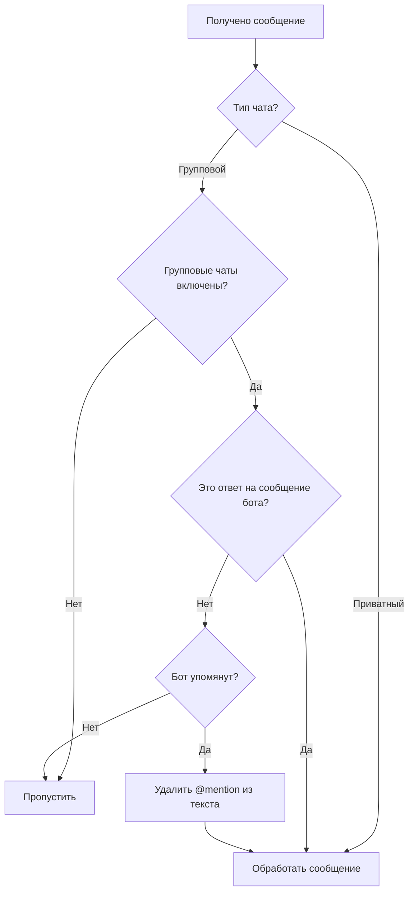
```mermaid
flowchart TD
    MSG[Получено сообщение] --> CHECK_TYPE{Тип чата?}
    CHECK_TYPE -->|Приватный| PROCESS[Обработать сообщение]
    CHECK_TYPE -->|Групповой| CHECK_GROUP{Групповые чаты включены?}
    CHECK_GROUP -->|Нет| SKIP[Пропустить]
    CHECK_GROUP -->|Да| CHECK_REPLY{Это ответ на сообщение бота?}
    CHECK_REPLY -->|Да| PROCESS
    CHECK_REPLY -->|Нет| CHECK_MENTION{Бот упомянут?}
    CHECK_MENTION -->|Да| CLEAN[Удалить @mention из текста] --> PROCESS
    CHECK_MENTION -->|Нет| SKIP
```

**Условия ответа в групповом чате:**
1. **Reply** - сообщение является ответом на сообщение бота
2. **Mention** - в тексте содержится имя бота (например, "Sil") или @username

При обнаружении упоминания @username удаляется из текста перед обработкой.

### Полный поток обработки

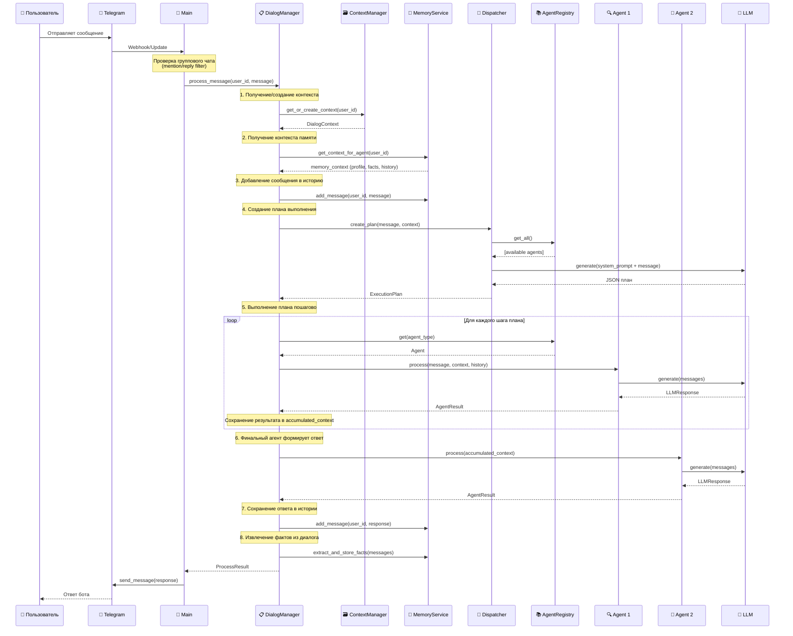
```mermaid
sequenceDiagram
    participant U as 👤 Пользователь
    participant T as 📱 Telegram
    participant M as 🚀 Main
    participant DM as 📋 DialogManager
    participant CM as 🗃️ ContextManager
    participant MS as 🧠 MemoryService
    participant D as 🎯 Dispatcher
    participant AR as 📚 AgentRegistry
    participant A1 as 🔍 Agent 1
    participant A2 as 💬 Agent 2
    participant LLM as 🤖 LLM

    U->>T: Отправляет сообщение
    T->>M: Webhook/Update
    Note over M: Проверка группового чата<br/>(mention/reply filter)
    M->>DM: process_message(user_id, message)
    
    Note over DM: 1. Получение/создание контекста
    DM->>CM: get_or_create_context(user_id)
    CM-->>DM: DialogContext
    
    Note over DM: 2. Получение контекста памяти
    DM->>MS: get_context_for_agent(user_id)
    MS-->>DM: memory_context (profile, facts, history)
    
    Note over DM: 3. Добавление сообщения в историю
    DM->>MS: add_message(user_id, message)
    
    Note over DM: 4. Создание плана выполнения
    DM->>D: create_plan(message, context)
    D->>AR: get_all()
    AR-->>D: [available agents]
    D->>LLM: generate(system_prompt + message)
    LLM-->>D: JSON план
    D-->>DM: ExecutionPlan
    
    Note over DM: 5. Выполнение плана пошагово
    
    loop Для каждого шага плана
        DM->>AR: get(agent_type)
        AR-->>DM: Agent
        DM->>A1: process(message, context, history)
        A1->>LLM: generate(messages)
        LLM-->>A1: LLMResponse
        A1-->>DM: AgentResult
        Note over DM: Сохранение результата в accumulated_context
    end
    
    Note over DM: 6. Финальный агент формирует ответ
    DM->>A2: process(accumulated_context)
    A2->>LLM: generate(messages)
    LLM-->>A2: LLMResponse
    A2-->>DM: AgentResult
    
    Note over DM: 7. Сохранение ответа в истории
    DM->>MS: add_message(user_id, response)
    
    Note over DM: 8. Извлечение фактов из диалога
    DM->>MS: extract_and_store_facts(messages)
    
    DM-->>M: ProcessResult
    M->>T: send_message(response)
    T-->>U: Ответ бота
```

---

## Структура ExecutionPlan

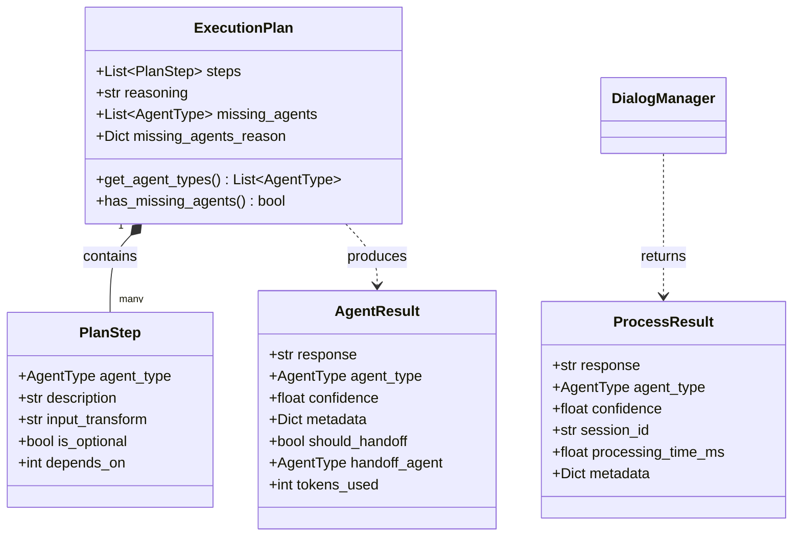
```mermaid
classDiagram
    class ExecutionPlan {
        +List~PlanStep~ steps
        +str reasoning
        +List~AgentType~ missing_agents
        +Dict missing_agents_reason
        +get_agent_types() List~AgentType~
        +has_missing_agents() bool
    }
    
    class PlanStep {
        +AgentType agent_type
        +str description
        +str input_transform
        +bool is_optional
        +int depends_on
    }
    
    class AgentResult {
        +str response
        +AgentType agent_type
        +float confidence
        +Dict metadata
        +bool should_handoff
        +AgentType handoff_agent
        +int tokens_used
    }
    
    class ProcessResult {
        +str response
        +AgentType agent_type
        +float confidence
        +str session_id
        +float processing_time_ms
        +Dict metadata
    }
    
    ExecutionPlan "1" *-- "many" PlanStep : contains
    ExecutionPlan ..> AgentResult : produces
    DialogManager ..> ProcessResult : returns
```

---

## Категории агентов

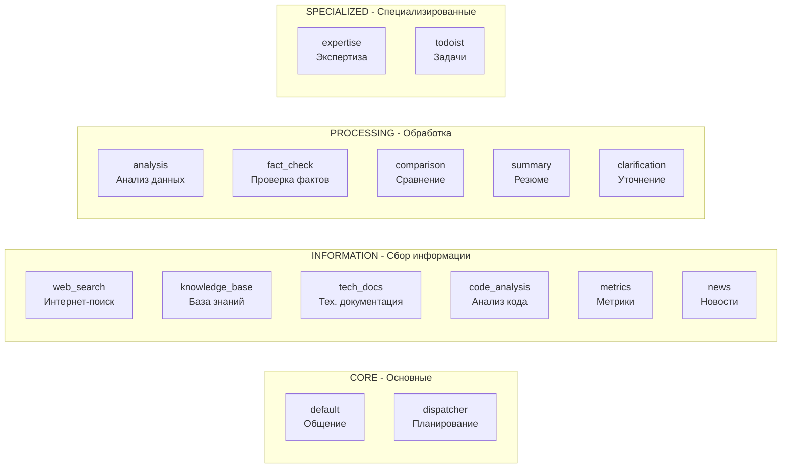
```mermaid
graph LR
    subgraph "CORE - Основные"
        DEFAULT[default<br/>Общение]
        DISPATCHER[dispatcher<br/>Планирование]
    end
    
    subgraph "INFORMATION - Сбор информации"
        WEB_SEARCH[web_search<br/>Интернет-поиск]
        KNOWLEDGE_BASE[knowledge_base<br/>База знаний]
        TECH_DOCS[tech_docs<br/>Тех. документация]
        CODE_ANALYSIS[code_analysis<br/>Анализ кода]
        METRICS[metrics<br/>Метрики]
        NEWS[news<br/>Новости]
    end
    
    subgraph "PROCESSING - Обработка"
        ANALYSIS[analysis<br/>Анализ данных]
        FACT_CHECK[fact_check<br/>Проверка фактов]
        COMPARISON[comparison<br/>Сравнение]
        SUMMARY[summary<br/>Резюме]
        CLARIFICATION[clarification<br/>Уточнение]
    end
    
    subgraph "SPECIALIZED - Специализированные"
        EXPERTISE[expertise<br/>Экспертиза]
        TODOIST[todoist<br/>Задачи]
    end
```

### Описание агентов

| Агент | Тип | Описание | Ключевые слова |
|-------|-----|----------|----------------|
| [`DefaultAgent`](src/nergal/dialog/default_agent.py) | CORE | Общий агент для разговоров, приветствий, финального ответа | - |
| [`WebSearchAgent`](src/nergal/dialog/agents/web_search_agent.py) | INFO | Поиск в интернете, актуальные факты | "найди", "поиск", "google" |
| [`NewsAgent`](src/nergal/dialog/agents/news_agent.py) | INFO | Агрегация новостей из нескольких источников | "новости", "пресса", "what happened" |
| [`KnowledgeBaseAgent`](src/nergal/dialog/agents/knowledge_base_agent.py) | INFO | Поиск по корпоративной базе знаний | "база знаний", "регламент" |
| [`TechDocsAgent`](src/nergal/dialog/agents/tech_docs_agent.py) | INFO | Техническая документация | "документация", "api", "how to" |
| [`CodeAnalysisAgent`](src/nergal/dialog/agents/code_analysis_agent.py) | INFO | Анализ кодовой базы | "код", "функция", "класс" |
| [`MetricsAgent`](src/nergal/dialog/agents/metrics_agent.py) | INFO | Метрики и статистика | "метрики", "статистика", "kpi" |
| [`AnalysisAgent`](src/nergal/dialog/agents/analysis_agent.py) | PROC | Анализ и синтез информации | "анализ", "разбор" |
| [`FactCheckAgent`](src/nergal/dialog/agents/fact_check_agent.py) | PROC | Проверка достоверности | "правда", "верификация" |
| [`ComparisonAgent`](src/nergal/dialog/agents/comparison_agent.py) | PROC | Сравнение альтернатив | "сравни", "отличия", "vs" |
| [`SummaryAgent`](src/nergal/dialog/agents/summary_agent.py) | PROC | Резюмирование | "резюме", "кратко", "tl;dr" |
| [`ClarificationAgent`](src/nergal/dialog/agents/clarification_agent.py) | PROC | Уточнение запросов | - |
| [`ExpertiseAgent`](src/nergal/dialog/agents/expertise_agent.py) | SPEC | Экспертные знания | "экспертиза", "консультация" |
| [`TodoistAgent`](src/nergal/dialog/agents/todoist_agent.py) | SPEC | Управление задачами Todoist | "задач", "todo", "дела" |

---

## Примеры планов выполнения

### Пример 1: Простое приветствие
```json
{
    "steps": [
        {"agent": "default", "description": "ответить на приветствие"}
    ],
    "reasoning": "простое приветствие не требует дополнительных агентов"
}
```


```mermaid
graph LR
    MSG[Привет!] --> D[default]
    D --> RESP[Привет! Чем могу помочь?]
```

### Пример 2: Поиск актуальной информации
```json
{
    "steps": [
        {"agent": "web_search", "description": "найти актуальную информацию"},
        {"agent": "fact_check", "description": "проверить достоверность", "is_optional": true},
        {"agent": "default", "description": "сформировать ответ"}
    ],
    "reasoning": "для ответа нужен поиск, проверка и формирование ответа"
}
```

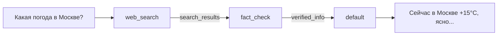
```mermaid
graph LR
    MSG[Какая погода в Москве?] --> WS[web_search]
    WS -->|search_results| FC[fact_check]
    FC -->|verified_info| D[default]
    D --> RESP[Сейчас в Москве +15°C, ясно...]
```

### Пример 3: Управление задачами
```json
{
    "steps": [
        {"agent": "todoist", "description": "получить список задач пользователя"}
    ],
    "reasoning": "запрос связан с задачами, используется интеграция с Todoist"
}
```

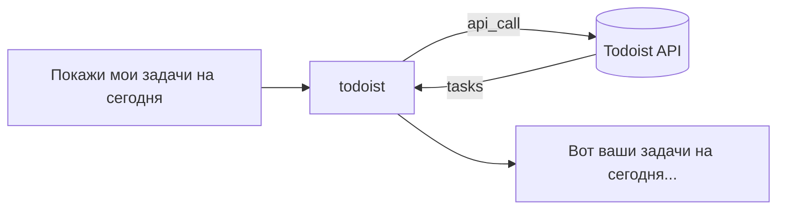
```mermaid
graph LR
    MSG[Покажи мои задачи на сегодня] --> T[todoist]
    T -->|api_call| TD[(Todoist API)]
    TD -->|tasks| T
    T --> RESP[Вот ваши задачи на сегодня...]
```

---

## Система памяти

### Архитектура памяти

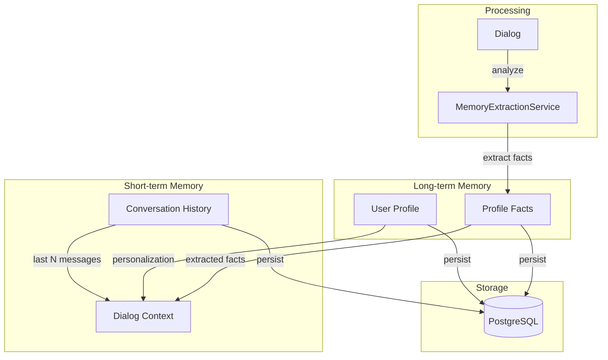
```mermaid
flowchart TB
    subgraph "Short-term Memory"
        STM[Conversation History]
        STM -->|last N messages| Context[Dialog Context]
    end
    
    subgraph "Long-term Memory"
        UP[User Profile]
        PF[Profile Facts]
        UP -->|personalization| Context
        PF -->|extracted facts| Context
    end
    
    subgraph "Storage"
        DB[(PostgreSQL)]
        STM -->|persist| DB
        UP -->|persist| DB
        PF -->|persist| DB
    end
    
    subgraph "Processing"
        MES[MemoryExtractionService]
        Dialog -->|analyze| MES
        MES -->|extract facts| PF
    end
```

### Компоненты системы памяти

| Компонент | Файл | Описание |
|-----------|------|----------|
| [`MemoryService`](src/nergal/memory/service.py:30) | memory/service.py | Главная точка координации памяти |
| [`MemoryExtractionService`](src/nergal/memory/extraction.py) | memory/extraction.py | Извлечение фактов из диалогов |
| [`UserRepository`](src/nergal/database/repositories.py) | database/repositories.py | Репозиторий пользователей |
| [`ProfileRepository`](src/nergal/database/repositories.py) | database/repositories.py | Репозиторий профилей |
| [`ConversationRepository`](src/nergal/database/repositories.py) | database/repositories.py | Репозиторий диалогов |

### Контекст памяти для агентов

```python
# Пример контекста, передаваемого агентам
memory_context = {
    "user_id": 123456789,
    "user_name": "Иван Петров",
    "user_display_name": "Иван",
    "profile_summary": "Пользователь интересуется Python и ML",
    "conversation_summary": "Последние 5 сообщений о разработке",
    "profile": {...},  # Полный профиль
    "facts": [...],    # Извлеченные факты
    "recent_messages": [
        {"role": "user", "content": "..."},
        {"role": "assistant", "content": "..."}
    ],
    "session_id": "abc123"
}
```

---

## Жизненный цикл контекста

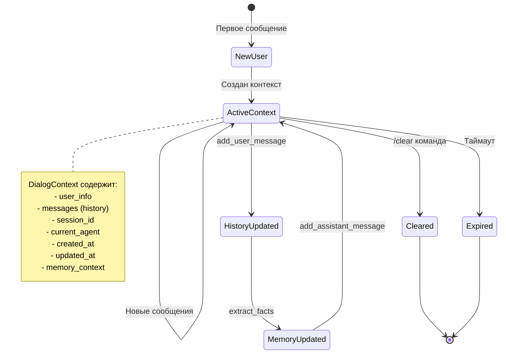
```mermaid
stateDiagram-v2
    [*] --> NewUser: Первое сообщение
    NewUser --> ActiveContext: Создан контекст
    ActiveContext --> ActiveContext: Новые сообщения
    ActiveContext --> HistoryUpdated: add_user_message
    HistoryUpdated --> MemoryUpdated: extract_facts
    MemoryUpdated --> ActiveContext: add_assistant_message
    ActiveContext --> Cleared: /clear команда
    ActiveContext --> Expired: Таймаут
    Cleared --> [*]
    Expired --> [*]
    
    note right of ActiveContext
        DialogContext содержит:
        - user_info
        - messages (history)
        - session_id
        - current_agent
        - created_at
        - updated_at
        - memory_context
    end note
```

---

## Взаимодействие компонентов при ошибке

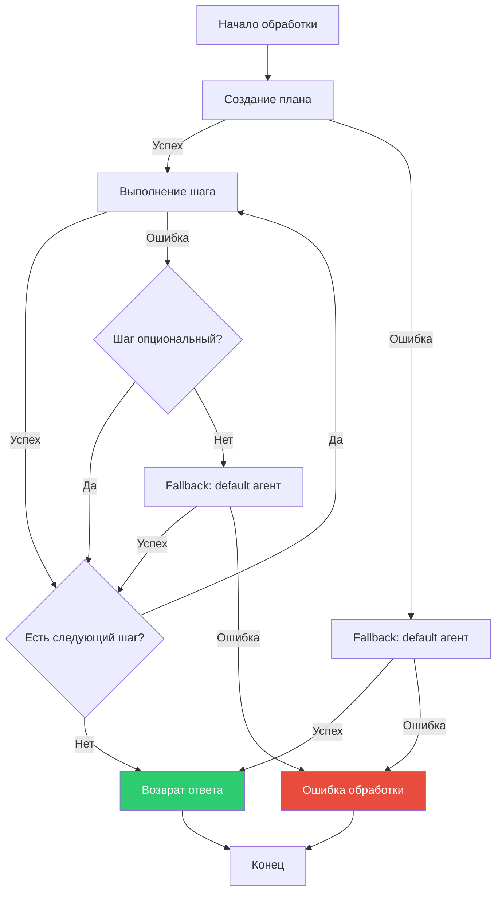
```mermaid
flowchart TD
    START[Начало обработки] --> PLAN[Создание плана]
    PLAN --> |Успех| EXECUTE[Выполнение шага]
    PLAN --> |Ошибка| FALLBACK_PLAN[Fallback: default агент]
    
    EXECUTE --> |Успех| NEXT_STEP{Есть следующий шаг?}
    EXECUTE --> |Ошибка| CHECK_OPTIONAL{Шаг опциональный?}
    
    CHECK_OPTIONAL --> |Да| NEXT_STEP
    CHECK_OPTIONAL --> |Нет| FALLBACK_STEP[Fallback: default агент]
    
    FALLBACK_STEP --> |Успех| NEXT_STEP
    FALLBACK_STEP --> |Ошибка| ERROR_RESPONSE[Ошибка обработки]
    
    NEXT_STEP --> |Да| EXECUTE
    NEXT_STEP --> |Нет| SUCCESS[Возврат ответа]
    
    FALLBACK_PLAN --> |Успех| SUCCESS
    FALLBACK_PLAN --> |Ошибка| ERROR_RESPONSE
    
    SUCCESS --> END[Конец]
    ERROR_RESPONSE --> END
    
    style ERROR_RESPONSE fill:#e74c3c,color:#fff
    style SUCCESS fill:#2ecc71,color:#fff
```

---

## Ключевые классы и их ответственность

| Класс | Файл | Ответственность |
|-------|------|-----------------|
| [`DialogManager`](src/nergal/dialog/manager.py:56) | manager.py | Главная точка координации, управление контекстом, выполнение планов |
| [`DispatcherAgent`](src/nergal/dialog/dispatcher_agent.py:88) | dispatcher_agent.py | Анализ сообщений, создание планов выполнения |
| [`AgentRegistry`](src/nergal/dialog/base.py:253) | base.py | Хранение и поиск агентов |
| [`ContextManager`](src/nergal/dialog/context.py) | context.py | Управление контекстами пользователей |
| [`BaseAgent`](src/nergal/dialog/base.py:146) | base.py | Абстрактный базовый класс для всех агентов |
| [`BaseSpecializedAgent`](src/nergal/dialog/agents/base_specialized.py:20) | base_specialized.py | Базовый класс для специализированных агентов с Template Method |
| [`ExecutionPlan`](src/nergal/dialog/base.py:105) | base.py | Структура плана выполнения |
| [`PlanStep`](src/nergal/dialog/base.py:86) | base.py | Отдельный шаг в плане |
| [`MemoryService`](src/nergal/memory/service.py:30) | memory/service.py | Управление памятью пользователей |
| [`MemoryExtractionService`](src/nergal/memory/extraction.py) | memory/extraction.py | Извлечение фактов из диалогов |
| [`Container`](src/nergal/container.py) | container.py | DI контейнер, управление зависимостями |
| [`BotApplication`](src/nergal/main.py) | main.py | Lifecycle management бота |
| [`DatabaseConnection`](src/nergal/database/connection.py) | connection.py | Управление connection pool БД |
| [`should_respond_in_group()`](src/nergal/handlers/messages.py) | handlers/messages.py | Фильтрация сообщений в групповых чатах |
| [`clean_message_text()`](src/nergal/handlers/messages.py) | handlers/messages.py | Очистка @mention из текста сообщения |

---

## DI Container Architecture

Проект использует централизованный DI контейнер на базе библиотеки `dependency-injector`.

### Структура DI Container

```
Container
├── config (Configuration)
├── settings (Singleton) ──────────────────┐
├── llm_provider (Factory)                 │
├── stt_provider (Singleton)               │
├── web_search_provider (Singleton)        │
├── database (Singleton)                   │
├── Repositories (Factory)                 │
│   ├── user_repository                    │
│   ├── profile_repository                 │
│   ├── conversation_repository            │
│   ├── web_search_telemetry_repository    │
│   └── user_integration_repository        │
├── memory_service (Singleton)             │
├── dialog_manager (Singleton) ◄───────────┘
│   └── Depends on: settings, llm_provider, web_search_provider, memory_service
└── metrics_server (Singleton)
```

### Dependency Flow

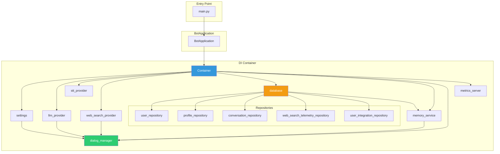
```mermaid
graph TB
    subgraph "Entry Point"
        MAIN[main.py]
    end
    
    subgraph "BotApplication"
        BA[BotApplication]
    end
    
    subgraph "DI Container"
        CONT[Container]
        SETTINGS[settings]
        LLM[llm_provider]
        STT[stt_provider]
        WS[web_search_provider]
        DB[database]
        MEM[memory_service]
        DM[dialog_manager]
        MET[metrics_server]
        
        subgraph "Repositories"
            UR[user_repository]
            PR[profile_repository]
            CR[conversation_repository]
            WSTR[web_search_telemetry_repository]
            UIR[user_integration_repository]
        end
    end
    
    MAIN --> BA
    BA --> CONT
    CONT --> SETTINGS
    CONT --> LLM
    CONT --> STT
    CONT --> WS
    CONT --> DB
    CONT --> MEM
    CONT --> DM
    CONT --> MET
    DB --> UR
    DB --> PR
    DB --> CR
    DB --> WSTR
    DB --> UIR
    SETTINGS --> DM
    LLM --> DM
    WS --> DM
    MEM --> DM
    DB --> MEM
    
    style CONT fill:#3498db,color:#fff
    style DM fill:#2ecc71,color:#fff
    style DB fill:#f39c12,color:#fff
```

### Пример использования DI Container

```python
# Production usage
from nergal.container import init_container, init_database, shutdown_database

# At startup
await init_database()
container = init_container()

# Get dependencies
dialog_manager = container.dialog_manager()
user_repo = container.user_repository()

# At shutdown
await shutdown_database()

# Testing with mocks
from nergal.container import override_container, reset_container
from unittest.mock import AsyncMock

container = Container()
mock_dialog_manager = AsyncMock()
container.dialog_manager.override(lambda: mock_dialog_manager)
override_container(container)

# ... run tests ...

reset_container()
```

### Lifecycle Management

| Функция | Описание |
|---------|----------|
| [`init_container()`](src/nergal/container.py) | Инициализация DI контейнера |
| [`get_container()`](src/nergal/container.py) | Получение текущего контейнера |
| [`override_container()`](src/nergal/container.py) | Подмена контейнера (для тестов) |
| [`reset_container()`](src/nergal/container.py) | Сброс контейнера |
| [`init_database()`](src/nergal/container.py) | Async инициализация БД |
| [`shutdown_database()`](src/nergal/container.py) | Async закрытие БД |

---

## Конфигурация системы

```python
# Пример инициализации через DI Container
from nergal.container import init_container, init_database

# At startup
await init_database()
container = init_container()

# Get dependencies from container
settings = container.settings()
dialog_manager = container.dialog_manager()
memory_service = container.memory_service()

# Регистрация дополнительных агентов через agent_loader
from nergal.dialog.agent_loader import register_configured_agents

register_configured_agents(
    registry=dialog_manager.agent_registry,
    settings=settings,
    llm_provider=container.llm_provider(),
    search_provider=container.web_search_provider(),
)
```

---

## Структура проекта

```
src/nergal/
├── config.py                    # Конфигурация (pydantic-settings)
├── container.py                 # DI Container (dependency-injector)
├── main.py                      # Точка входа, BotApplication class
├── exceptions.py                # Исключения
├── auth.py                      # Авторизация пользователей
├── handlers/                    # Telegram bot handlers (извлечены из main.py)
│   ├── __init__.py             # Module exports
│   ├── commands.py             # Command handlers (/start, /help, /status, etc.)
│   └── messages.py             # Message handlers (text, voice) + utilities
├── database/
│   ├── connection.py            # Подключение к БД (DatabaseConnection class)
│   ├── migrations.py            # Миграции БД
│   ├── models.py                # SQLAlchemy модели
│   └── repositories.py          # Репозитории для работы с БД
├── dialog/
│   ├── __init__.py              # Публичный API модуля
│   ├── base.py                  # Базовые классы агентов
│   ├── constants.py             # Константы и промпты
│   ├── context.py               # Контекст диалога
│   ├── default_agent.py         # DefaultAgent
│   ├── dispatcher_agent.py      # DispatcherAgent
│   ├── manager.py               # DialogManager
│   ├── styles.py                # Стили ответов
│   ├── agent_loader.py          # Загрузка агентов по конфигурации
│   └── agents/                  # Специализированные агенты
│       ├── __init__.py
│       ├── base_specialized.py  # Базовый класс для спец. агентов
│       ├── web_search_agent.py  # Веб-поиск
│       ├── todoist_agent.py     # Todoist интеграция
│       ├── knowledge_base_agent.py
│       ├── tech_docs_agent.py
│       ├── code_analysis_agent.py
│       ├── metrics_agent.py
│       ├── news_agent.py
│       ├── analysis_agent.py
│       ├── fact_check_agent.py
│       ├── comparison_agent.py
│       ├── summary_agent.py
│       ├── clarification_agent.py
│       └── expertise_agent.py
├── llm/                         # LLM провайдеры
│   ├── __init__.py
│   ├── base.py                  # Базовый класс
│   ├── factory.py               # Фабрика провайдеров
│   └── providers/
│       └── zai.py               # Z.ai реализация
├── memory/                      # Система памяти
│   ├── __init__.py
│   ├── service.py               # MemoryService
│   └── extraction.py            # Извлечение фактов
├── monitoring/                  # Мониторинг
│   ├── __init__.py
│   ├── health.py                # Health checks
│   ├── logging_config.py        # Конфигурация логирования
│   └── metrics.py               # Prometheus метрики
├── admin/                       # Admin веб-панель
│   ├── __init__.py
│   └── server.py                # Flask сервер управления пользователями
├── stt/                         # Speech-to-Text
│   ├── __init__.py
│   ├── base.py
│   ├── factory.py
│   ├── audio_utils.py           # Конвертация аудио
│   └── providers/
│       └── local_whisper.py
├── integrations/                # Внешние интеграции
│   ├── __init__.py
│   └── todoist.py               # Todoist API клиент
├── utils/
│   └── markdown_to_telegram.py
└── web_search/                  # Веб-поиск
    ├── __init__.py
    ├── base.py
    ├── reliability.py           # Retry logic, reliability features
    └── zai_mcp_http.py          # MCP HTTP провайдер
```

---

# Анализ архитектуры агентов

## Плюсы текущей архитектуры

### 1. **Гибкая система планирования**
- [`DispatcherAgent`](src/nergal/dialog/dispatcher_agent.py:88) динамически формирует список доступных агентов
- LLM составляет планы выполнения на основе актуального состояния системы
- Поддержка `missing_agents` для обратной связи о нехватке функционала

### 2. **Template Method Pattern**
- [`BaseSpecializedAgent`](src/nergal/dialog/agents/base_specialized.py:20) предоставляет стандартизированный способ определения confidence
- Hook-методы позволяют кастомизировать поведение без дублирования кода
- Единая логика keyword/pattern/context matching

### 3. **Конфигурируемость через переменные окружения**
- Все агенты включаются/выключаются через `AGENTS_*` переменные
- [`AgentSettings`](src/nergal/config.py:203) использует pydantic-settings для валидации
- Нет необходимости менять код для включения/выключения агентов

### 4. **DI Container**
- Централизованное управление зависимостями
- Легкое тестирование с mock-объектами
- Четкий lifecycle management

### 5. **Система памяти**
- Краткосрочная память (контекст диалога)
- Долгосрочная память (профили, факты)
- Автоматическое извлечение фактов через LLM

### 6. **Специализированные интеграции**
- [`TodoistAgent`](src/nergal/dialog/agents/todoist_agent.py:55) демонстрирует паттерн интеграции с внешними сервисами
- Хранение токенов пользователей в БД
- Graceful degradation при отсутствии интеграции

### 7. **Обработка ошибок**
- Fallback на default агент при ошибках планирования
- Опциональные шаги в плане (`is_optional: true`)
- Логирование всех ключевых операций

---

## Минусы текущей архитектуры

### 1. **Последовательное выполнение плана**
```
ПРОБЛЕМА: Все шаги выполняются последовательно, даже если они независимы
```
- Поле `depends_on` в [`PlanStep`](src/nergal/dialog/base.py:86) не используется для параллелизации
- Потенциальное время ответа растёт линейно с количеством шагов
- Нет возможности запустить web_search и knowledge_base параллельно

### 2. **Дублирование кода в agent_loader**
```python
# agent_loader.py содержит 14 почти идентичных функций create_*_agent
# и 14 одинаковых блоков if agent_settings.*_enabled в register_configured_agents
```
- Много boilerplate кода
- Легко забыть добавить нового агента в оба места

### 3. **Отсутствие кэширования результатов агентов**
- Повторные запросы с одинаковым сообщением выполняются заново
- Нет in-memory кэша для частых запросов
- Web search выполняется даже для идентичных запросов

### 4. **Слабая типизация AgentResult.metadata**
```python
metadata: dict[str, Any] = field(default_factory=dict)
```
- Нет структуры для метаданных
- Сложно документировать что агент возвращает
- Нет валидации структуры результата

### 5. **Отсутствие приоритизации агентов**
- Все агенты равноправны при определении confidence
- Нет механизма preferences пользователя
- Нельзя задать "любимый" агент для определённых типов запросов

### 6. **Ограниченный контекст между агентами**
- `accumulated_context` передаётся, но структура не формализована
- Агенты не знают результаты предыдущих агентов явно
- Сложно строить цепочки зависимостей

### 7. **Нет механизма отмены плана**
- Если пользователь прерывает выполнение, нет способа остановить
- Долгие операции (web search) нельзя отменить
- Нет timeout на уровне агента

### 8. **Legacy агенты в AgentType**
```python
# base.py:63-67
# Legacy/deprecated - kept for backward compatibility
FAQ = "faq"
SMALL_TALK = "small_talk"
TASK = "task"
UNKNOWN = "unknown"
```
- Загромождают enum
- Могут вызывать путаницу при планировании

---

## Предложения по улучшению архитектуры

### 1. **Параллельное выполнение независимых шагов**

```python
# Предложение: Группировка независимых шагов
@dataclass
class PlanStep:
    agent_type: AgentType
    description: str
    depends_on: list[int] | None = None  # Список зависимостей
    parallel_group: int | None = None     # Группа для параллельного выполнения

# Пример плана с параллелизацией:
{
    "steps": [
        {"agent": "web_search", "description": "...", "parallel_group": 1},
        {"agent": "knowledge_base", "description": "...", "parallel_group": 1},
        {"agent": "analysis", "description": "...", "depends_on": [0, 1]},
        {"agent": "default", "description": "...", "depends_on": [2]}
    ]
}
```

**Реализация:**
```python
async def _execute_plan(self, plan: ExecutionPlan) -> PlanExecutionResult:
    """Execute plan with parallel step support."""
    results = {}
    
    for step in plan.steps:
        if step.depends_on:
            # Wait for dependencies
            await asyncio.gather(*[
                results[i] for i in step.depends_on
            ])
        
        # Execute step (potentially in parallel with same group)
        results[step.index] = asyncio.create_task(
            self._execute_step(step)
        )
    
    return await self._aggregate_results(results)
```

### 2. **Реестр агентов с автоматической регистрацией**

```python
# Предложение: Декоратор для автоматической регистрации
class AgentRegistry:
    _agent_factories: dict[AgentType, Callable[..., BaseAgent]] = {}
    
    @classmethod
    def register_factory(cls, agent_type: AgentType):
        """Decorator to register agent factory."""
        def decorator(factory_func):
            cls._agent_factories[agent_type] = factory_func
            return factory_func
        return decorator

# Использование:
@AgentRegistry.register_factory(AgentType.WEB_SEARCH)
def create_web_search_agent(llm_provider, settings, **kwargs):
    return WebSearchAgent(llm_provider, settings.web_search)

# Автоматическая регистрация:
def register_configured_agents(registry, settings, llm_provider):
    for agent_type, factory in AgentRegistry._agent_factories.items():
        if settings.agents.is_enabled(agent_type):
            registry.register(factory(llm_provider, settings))
```

### 3. **Кэширование результатов агентов**

```python
# Предложение: Кэширующий декоратор для агентов
from functools import lru_cache
import hashlib

class CachedAgentResult:
    """Cache wrapper for agent results."""
    
    def __init__(self, ttl_seconds: int = 300):
        self.ttl = ttl_seconds
        self._cache: dict[str, tuple[float, AgentResult]] = {}
    
    def _cache_key(self, message: str, agent_type: AgentType) -> str:
        content = f"{agent_type.value}:{message}"
        return hashlib.md5(content.encode()).hexdigest()
    
    async def get_or_execute(
        self, 
        agent: BaseAgent, 
        message: str, 
        context: dict
    ) -> AgentResult:
        key = self._cache_key(message, agent.agent_type)
        
        if key in self._cache:
            timestamp, result = self._cache[key]
            if time.time() - timestamp < self.ttl:
                return result
        
        result = await agent.process(message, context, [])
        self._cache[key] = (time.time(), result)
        return result
```

### 4. **Типизированные метаданные агентов**

```python
# Предложение: Структурированные метаданные
from dataclasses import dataclass
from typing import Literal

@dataclass
class WebSearchMetadata:
    sources: list[str]
    query: str
    result_count: int
    search_time_ms: float

@dataclass
class TodoistMetadata:
    action: Literal["create", "list", "complete", "delete"]
    task_count: int
    project_name: str | None

@dataclass
class AgentResult[G]:
    response: str
    agent_type: AgentType
    confidence: float
    metadata: G  # Generic typed metadata
    tokens_used: int | None

# Использование:
WebSearchResult = AgentResult[WebSearchMetadata]
TodoistResult = AgentResult[TodoistMetadata]
```

### 5. **Система предпочтений пользователя**

```python
# Предложение: Пользовательские предпочтения агентов
@dataclass
class AgentPreference:
    agent_type: AgentType
    weight: float  # -1.0 to 1.0 (negative = avoid, positive = prefer)
    keywords: list[str]  # Keywords that trigger this preference

class PreferenceManager:
    """Manages user preferences for agents."""
    
    def get_boost(
        self, 
        user_id: int, 
        agent_type: AgentType, 
        message: str
    ) -> float:
        """Get confidence boost based on user preferences."""
        preferences = self._get_user_preferences(user_id)
        
        for pref in preferences:
            if pref.agent_type == agent_type:
                if any(kw in message.lower() for kw in pref.keywords):
                    return pref.weight
        
        return 0.0
```

### 6. **Формализованный контекст между агентами**

```python
# Предложение: Структурированный контекст выполнения
@dataclass
class StepResult:
    step_index: int
    agent_type: AgentType
    output: str
    structured_data: dict[str, Any]  # TypedJSON
    confidence: float

@dataclass
class ExecutionContext:
    """Formalized context passed between agents."""
    original_message: str
    user_context: dict[str, Any]
    step_results: list[StepResult]
    
    def get_result(self, agent_type: AgentType) -> StepResult | None:
        """Get result from specific agent type."""
        return next(
            (r for r in self.step_results if r.agent_type == agent_type),
            None
        )
    
    def get_accumulated_context(self) -> str:
        """Build context string from all previous results."""
        parts = []
        for result in self.step_results:
            parts.append(f"[{result.agent_type.value}]: {result.output}")
        return "\n\n".join(parts)
```

### 7. **Механизм отмены и timeout**

```python
# Предложение: CancellationToken для агентов
import asyncio
from contextlib import asynccontextmanager

class CancellationToken:
    """Token for cancelling agent execution."""
    
    def __init__(self):
        self._cancelled = False
        self._waiters: list[asyncio.Event] = []
    
    def cancel(self):
        self._cancelled = True
        for waiter in self._waiters:
            waiter.set()
    
    @property
    def is_cancelled(self) -> bool:
        return self._cancelled
    
    async def check_cancelled(self):
        if self._cancelled:
            raise asyncio.CancelledError("Agent execution cancelled")

class AgentExecutor:
    """Executor with timeout and cancellation support."""
    
    async def execute_with_timeout(
        self,
        agent: BaseAgent,
        message: str,
        context: dict,
        timeout_seconds: float = 30.0,
        cancellation_token: CancellationToken | None = None,
    ) -> AgentResult:
        try:
            return await asyncio.wait_for(
                agent.process(message, context, []),
                timeout=timeout_seconds
            )
        except asyncio.TimeoutError:
            return AgentResult(
                response="Превышено время ожидания",
                agent_type=agent.agent_type,
                confidence=0.0,
                metadata={"error": "timeout"}
            )
```

### 8. **Удаление legacy агентов**

```python
# Предложение: Чистый AgentType enum
class AgentType(str, Enum):
    """Types of agents available in the system."""
    
    # Core agents
    DEFAULT = "default"
    DISPATCHER = "dispatcher"
    
    # Information gathering agents
    WEB_SEARCH = "web_search"
    KNOWLEDGE_BASE = "knowledge_base"
    TECH_DOCS = "tech_docs"
    CODE_ANALYSIS = "code_analysis"
    METRICS = "metrics"
    NEWS = "news"
    
    # Processing/analysis agents
    ANALYSIS = "analysis"
    FACT_CHECK = "fact_check"
    COMPARISON = "comparison"
    SUMMARY = "summary"
    CLARIFICATION = "clarification"
    
    # Specialized agents
    EXPERTISE = "expertise"
    TODOIST = "todoist"
    
    # Удалить: FAQ, SMALL_TALK, TASK, UNKNOWN
```

---

## Приоритеты улучшений

| Приоритет | Улучшение | Сложность | Влияние |
|-----------|-----------|-----------|---------|
| 🔴 Высокий | Параллельное выполнение | Средняя | Высокое (производительность) |
| 🔴 Высокий | Кэширование результатов | Низкая | Высокое (производительность) |
| 🟡 Средний | Типизированные метаданные | Средняя | Среднее (надёжность) |
| 🟡 Средний | Механизм timeout/отмены | Низкая | Среднее (UX) |
| 🟢 Низкий | Автоматическая регистрация | Средняя | Низкое (DX) |
| 🟢 Низкий | Система предпочтений | Высокая | Низкое (персонализация) |
| 🟢 Низкий | Удаление legacy | Низкая | Низкое (чистота кода) |

---

## Заключение

Текущая архитектура агентов обеспечивает хорошую гибкость и расширяемость системы. Основные сильные стороны:

1. **Динамическое планирование** через LLM позволяет адаптироваться к различным запросам
2. **Template Method Pattern** унифицирует логику определения confidence
3. **DI Container** упрощает тестирование и управление зависимостями

Ключевые области для улучшения:

1. **Производительность** — параллельное выполнение и кэширование
2. **Надёжность** — типизация метаданных и механизмы отмены
3. **Чистота кода** — устранение дублирования и legacy элементов

Предложенные улучшения можно внедрять постепенно, начиная с кэширования (минимальные изменения, большой эффект) и параллельного выполнения (средние изменения, значительный эффект).
