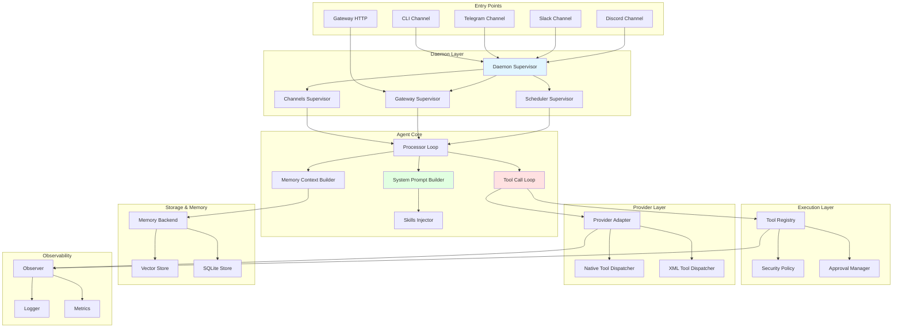
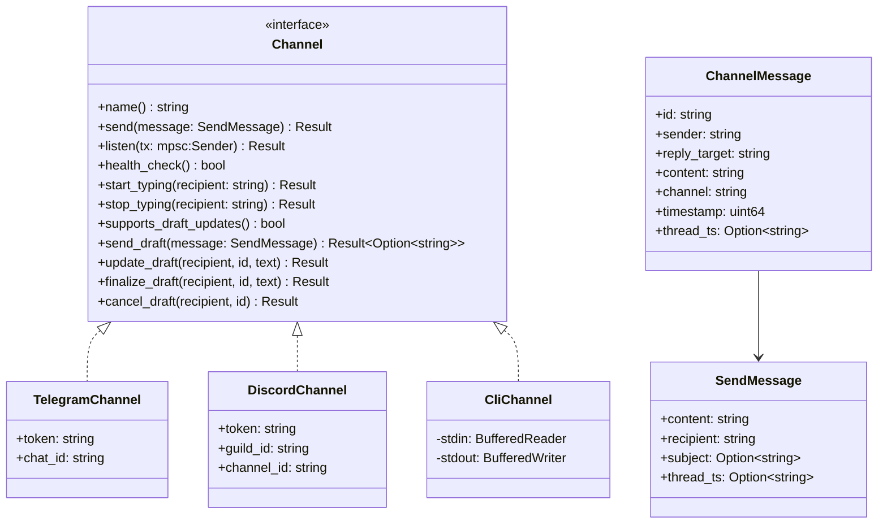
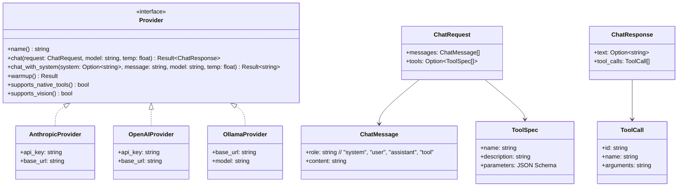
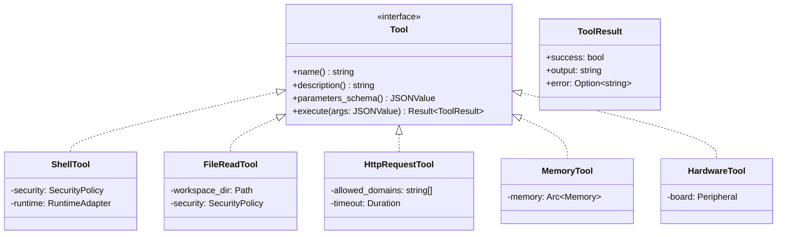
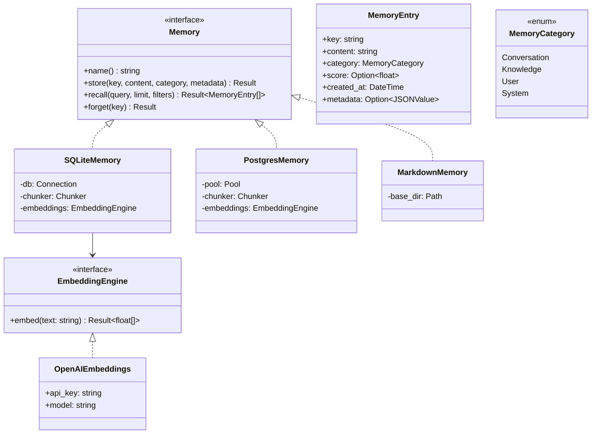
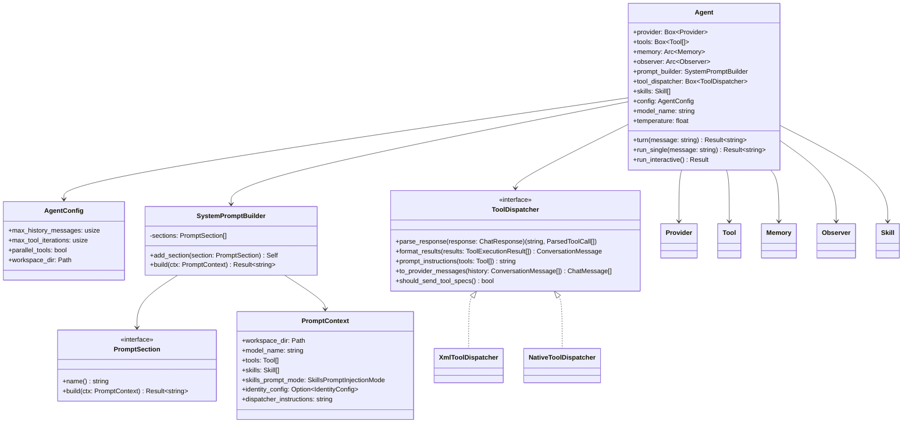
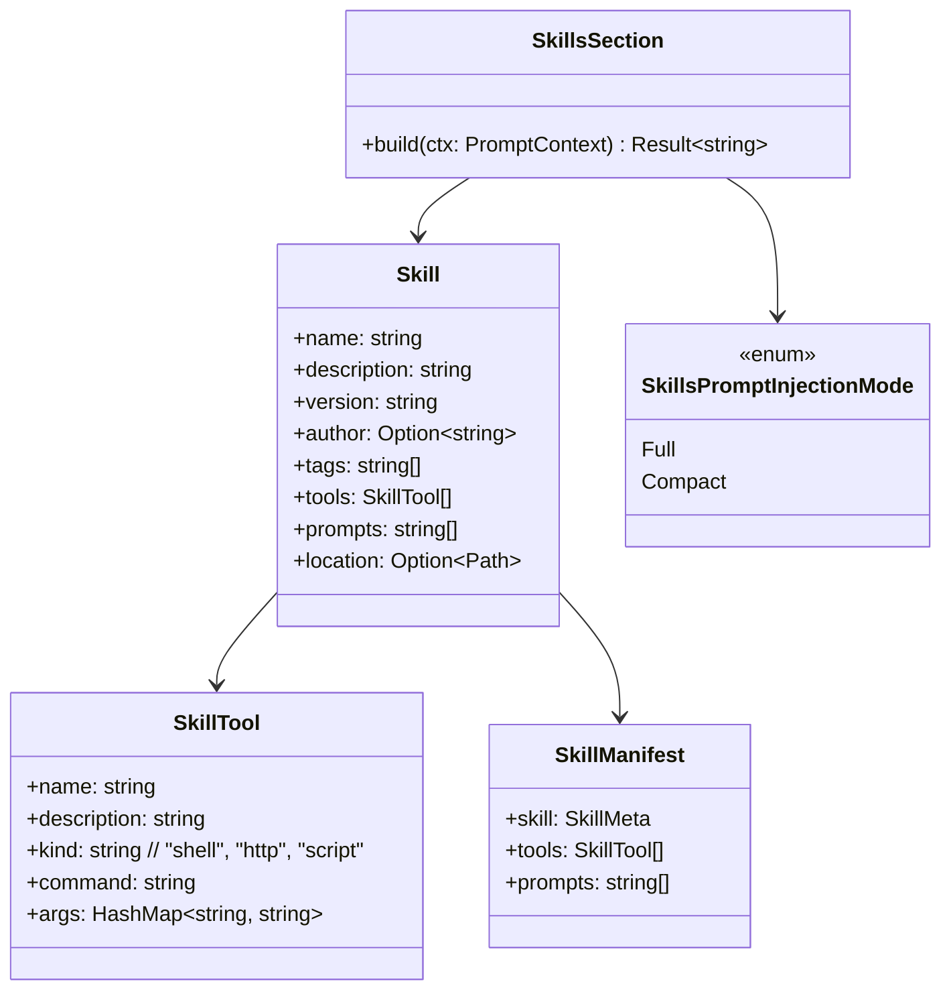
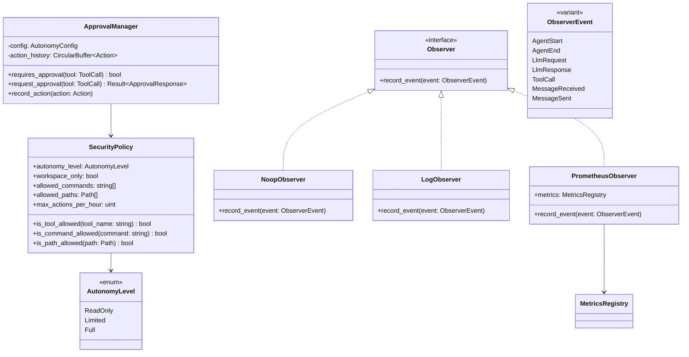
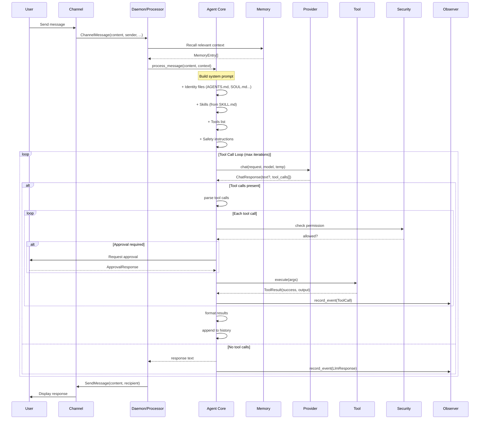
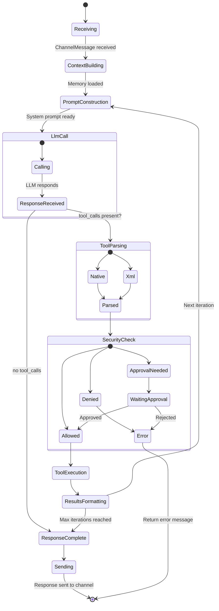

# ZeroClaw Architecture Guide

> Comprehensive guide for implementing a similar AI agent runtime architecture in another programming language.

---

## Table of Contents

1. [Architecture Overview](#architecture-overview)
2. [Core Design Principles](#core-design-principles)
3. [Component Diagram](#component-diagram)
4. [Class/Module Architecture](#classmodule-architecture)
5. [Message Lifecycle](#message-lifecycle)
6. [Core Components Deep Dive](#core-components-deep-dive)
7. [Integration Patterns](#integration-patterns)
8. [Implementation Roadmap](#implementation-roadmap)
9. [Language-Specific Considerations](#language-specific-considerations)

---

## Architecture Overview

ZeroClaw is a **trait-driven, modular AI agent runtime** optimized for:
- High performance (async, parallel tool execution)
- High efficiency (minimal overhead, binary size aware)
- High stability (exponential backoff, supervision trees)
- High security (policy enforcement, secret scrubbing)
- High extensibility (trait-based plugin system)

### Key Architectural Patterns

| Pattern | Purpose | Implementation |
|---------|---------|----------------|
| **Trait/Object Protocol** | Extensibility without recompilation | `Channel`, `Provider`, `Tool`, `Memory`, `Observer`, `Peripheral` |
| **Factory Pattern** | Dynamic instantiation from config | `create_routed_provider()`, `create_memory()`, `all_tools()` |
| **Supervisor Tree** | Fault tolerance with auto-restart | Daemon component supervisors with exponential backoff |
| **Message Loop** | Agentic tool iteration | `run_tool_call_loop()` with bounded iterations |
| **RAG Context Injection** | Relevant memory retrieval | Hybrid search (dense + sparse embeddings) |
| **Skill System** | Domain-specific capabilities | Prompt injection + skill-specific tools |

---

## Core Design Principles

### 1. KISS (Keep It Simple, Stupid)

- Explicit control flow over clever meta-programming
- Typed structs over dynamic dictionaries
- Error paths are visible and localized

### 2. YAGNI (You Aren't Gonna Need It)

- No speculative features without concrete use cases
- Unsupported paths error explicitly rather than fake partial support

### 3. Trait + Factory Architecture

```rust
// Extension points are explicit and swappable
trait Channel {
    async fn send(&self, message: &SendMessage) -> Result<()>;
    async fn listen(&self, tx: mpsc::Sender<ChannelMessage>) -> Result<()>;
}

// Factory for dynamic instantiation
fn create_channel(name: &str, config: &ChannelConfig) -> Box<dyn Channel> {
    match name {
        "telegram" => Box::new(TelegramChannel::new(config)),
        "discord" => Box::new(DiscordChannel::new(config)),
        // ...
    }
}
```

### 4. Fail Fast + Explicit Errors

```rust
// Never silently broaden permissions
fn execute_tool(&self, tool: ToolCall) -> Result<ToolResult> {
    if !self.security.is_allowed(&tool.name) {
        bail!("Tool '{}' is not allowed by policy", tool.name);
    }
    // ...
}
```

---

## Component Diagram



---

## Class/Module Architecture

### Channel Subsystem



### Provider Subsystem



### Tool Subsystem



### Memory Subsystem



### Agent Core



### Skill System



### Security & Observability



---

## Message Lifecycle

### Full Flow Diagram



### Detailed State Transition



---

## Core Components Deep Dive

### 1. Channel Abstraction

**Purpose**: Uniform interface for all messaging platforms.

**Key Methods**:
- `listen(tx)` - Long-running listener that sends messages to an mpsc channel
- `send(message)` - Send a message to a recipient
- `health_check()` - Check if channel is healthy (used by supervisor)
- `start_typing()` / `stop_typing()` - Indicate typing status
- `send_draft()` / `update_draft()` / `finalize_draft()` - Progressive message updates

**Implementation Pattern**:
```python
# Pseudo-code for Python implementation
from abc import ABC, abstractmethod
from typing import Optional
import asyncio

class Channel(ABC):
    @abstractmethod
    def name(self) -> str:
        pass

    @abstractmethod
    async def send(self, message: SendMessage) -> None:
        pass

    @abstractmethod
    async def listen(self, tx: asyncio.Queue) -> None:
        pass

    @abstractmethod
    async def health_check(self) -> bool:
        return True

    async def start_typing(self, recipient: str) -> None:
        pass

    async def stop_typing(self, recipient: str) -> None:
        pass

    def supports_draft_updates(self) -> bool:
        return False

    async def send_draft(self, message: SendMessage) -> Optional[str]:
        return None

    async def update_draft(self, recipient: str, message_id: str, text: str) -> None:
        pass

    async def finalize_draft(self, recipient: str, message_id: str, text: str) -> None:
        pass

    async def cancel_draft(self, recipient: str, message_id: str) -> None:
        pass
```

**Factory Pattern**:
```python
def create_channel(config: ChannelConfig) -> Channel:
    match config.type:
        case "telegram":
            return TelegramChannel(config.telegram_token, config.chat_id)
        case "discord":
            return DiscordChannel(config.discord_token, config.guild_id)
        case "slack":
            return SlackChannel(config.slack_token, config.channel_id)
        case _:
            raise ValueError(f"Unknown channel type: {config.type}")
```

### 2. Tool Dispatcher

**Purpose**: Bridge between LLM responses and tool execution.

**Two Modes**:

1. **Native Tool Dispatcher** - For providers with native tool support (OpenAI, Anthropic):
```rust
// Provider returns structured tool calls
{
    "text": null,
    "tool_calls": [
        {"id": "call_123", "name": "shell", "arguments": "{\"command\":\"ls\"}"}
    ]
}
```

2. **XML Tool Dispatcher** - For text-only providers (Ollama, custom):
```
Let me check the directory.

<tool_call>
{"name": "shell", "arguments": {"command": "ls"}}
</tool_call>
```

**Implementation Pattern**:
```python
class ToolDispatcher(ABC):
    @abstractmethod
    def parse_response(self, response: ChatResponse) -> tuple[str, list[ParsedToolCall]]:
        pass

    @abstractmethod
    def format_results(self, results: list[ToolExecutionResult]) -> ConversationMessage:
        pass

    @abstractmethod
    def prompt_instructions(self, tools: list[Tool]) -> str:
        pass

    @abstractmethod
    def to_provider_messages(self, history: list[ConversationMessage]) -> list[ChatMessage]:
        pass

    @abstractmethod
    def should_send_tool_specs(self) -> bool:
        pass


class NativeToolDispatcher(ToolDispatcher):
    def parse_response(self, response: ChatResponse) -> tuple[str, list[ParsedToolCall]]:
        text = response.text or ""
        calls = []
        for tc in response.tool_calls:
            calls.append(ParsedToolCall(
                name=tc.name,
                arguments=json.loads(tc.arguments),
                tool_call_id=tc.id
            ))
        return text, calls

    def format_results(self, results: list[ToolExecutionResult]) -> ConversationMessage:
        return ConversationMessage.ToolResults([
            ToolResultMessage(
                tool_call_id=r.tool_call_id,
                content=r.output
            ) for r in results
        ])

    def prompt_instructions(self, tools: list[Tool]) -> str:
        return ""  # Native tools don't need instructions

    def should_send_tool_specs(self) -> bool:
        return True


class XmlToolDispatcher(ToolDispatcher):
    def parse_response(self, response: ChatResponse) -> tuple[str, list[ParsedToolCall]]:
        text = response.text or ""
        calls = self._parse_xml_tool_calls(text)
        return self._extract_text_from_xml(text), calls

    def _parse_xml_tool_calls(self, text: str) -> list[ParsedToolCall]:
        import re
        pattern = r'<tool_call>\s*({.*?})\s*</tool_call>'
        calls = []
        for match in re.finditer(pattern, text, re.DOTALL):
            try:
                data = json.loads(match.group(1))
                if name := data.get("name"):
                    calls.append(ParsedToolCall(
                        name=name,
                        arguments=data.get("arguments", {}),
                        tool_call_id=None
                    ))
            except json.JSONDecodeError:
                pass
        return calls

    def format_results(self, results: list[ToolExecutionResult]) -> ConversationMessage:
        content = ""
        for r in results:
            status = "ok" if r.success else "error"
            content += f'<tool_result name="{r.name}" status="{status}">\n{r.output}\n</tool_result>\n'
        return ConversationMessage.Chat(
            ChatMessage.user(f"[Tool results]\n{content}")
        )

    def prompt_instructions(self, tools: list[Tool]) -> str:
        instructions = "## Tool Use Protocol\n\n"
        instructions += "To use a tool, wrap a JSON object in <tool_call> tags:\n\n"
        instructions += '```\n<tool_call>\n{"name": "tool_name", "arguments": {"param": "value"}}\n</tool_call>\n```\n\n'
        instructions += "### Available Tools\n\n"
        for tool in tools:
            instructions += f"- **{tool.name()}**: {tool.description()}\n"
            instructions += f"  Parameters: `{tool.parameters_schema()}`\n"
        return instructions

    def should_send_tool_specs(self) -> bool:
        return False
```

### 3. Tool Call Loop

**Purpose**: Core agentic logic - iteratively call LLM and tools until completion.

**Key Algorithm**:
```python
async def run_tool_call_loop(
    provider: Provider,
    history: list[ChatMessage],
    tools: list[Tool],
    observer: Observer,
    model: str,
    temperature: float,
    max_iterations: int = 10,
    dispatcher: ToolDispatcher = None
) -> str:
    if dispatcher is None:
        dispatcher = NativeToolDispatcher() if provider.supports_native_tools() else XmlToolDispatcher()

    for iteration in range(max_iterations):
        # 1. Check cancellation
        if cancellation_token and cancellation_token.is_cancelled():
            raise ToolLoopCancelled()

        # 2. Prepare request
        tool_specs = [tool.spec() for tool in tools] if dispatcher.should_send_tool_specs() else None
        request = ChatRequest(
            messages=dispatcher.to_provider_messages(history),
            tools=tool_specs
        )

        # 3. Call LLM
        response = await provider.chat(request, model, temperature)

        # 4. Parse tool calls
        text, calls = dispatcher.parse_response(response)

        # 5. If no tool calls, return response
        if not calls:
            return text or response.text or ""

        # 6. Execute tools (parallel or sequential)
        results = await execute_tools(tools, calls, parallel=config.parallel_tools)

        # 7. Append results to history
        results_message = dispatcher.format_results(results)
        history.append(results_message)

        # 8. Compact history if needed
        trim_history(history, max_messages=config.max_history_messages)

    raise MaxIterationsExceeded(max_iterations)


async def execute_tools(
    tools: list[Tool],
    calls: list[ParsedToolCall],
    parallel: bool = False
) -> list[ToolExecutionResult]:
    if not parallel or len(calls) == 1:
        return [await execute_single_tool(tools, call) for call in calls]

    # Parallel execution
    tasks = [execute_single_tool(tools, call) for call in calls]
    return await asyncio.gather(*tasks)


async def execute_single_tool(
    tools: list[Tool],
    call: ParsedToolCall
) -> ToolExecutionResult:
    tool = next((t for t in tools if t.name() == call.name), None)
    if tool is None:
        return ToolExecutionResult(name=call.name, output=f"Unknown tool: {call.name}", success=False)

    try:
        result = await tool.execute(call.arguments)
        if result.success:
            return ToolExecutionResult(name=call.name, output=result.output, success=True)
        else:
            error_msg = result.error or result.output
            return ToolExecutionResult(name=call.name, output=f"Error: {error_msg}", success=False)
    except Exception as e:
        return ToolExecutionResult(name=call.name, output=f"Error: {e}", success=False)
```

### 4. Memory & RAG

**Purpose**: Store and retrieve relevant context using hybrid search.

**Components**:
- **Chunker**: Split long documents into searchable chunks
- **Embedding Engine**: Convert text to vector representations
- **Vector Store**: Store and query embeddings
- **Metadata Store**: Store structured data (SQLite, PostgreSQL)

**Implementation Pattern**:
```python
class HybridMemory:
    def __init__(
        self,
        embeddings: EmbeddingEngine,
        vector_store: VectorStore,
        metadata_store: MetadataStore,
        chunker: Chunker
    ):
        self.embeddings = embeddings
        self.vector_store = vector_store
        self.metadata_store = metadata_store
        self.chunker = chunker

    async def store(
        self,
        key: str,
        content: str,
        category: MemoryCategory,
        metadata: Optional[dict] = None
    ) -> None:
        # 1. Store in metadata
        entry_id = await self.metadata_store.insert(key, content, category, metadata)

        # 2. Chunk content
        chunks = self.chunker.chunk(content)

        # 3. Embed and store chunks
        for i, chunk in enumerate(chunks):
            embedding = await self.embeddings.embed(chunk)
            await self.vector_store.insert(
                entry_id=entry_id,
                chunk_index=i,
                embedding=embedding,
                text=chunk
            )

    async def recall(
        self,
        query: str,
        limit: int = 5,
        filters: Optional[dict] = None
    ) -> list[MemoryEntry]:
        # 1. Embed query
        query_embedding = await self.embeddings.embed(query)

        # 2. Vector search (dense)
        vector_results = await self.vector_store.search(
            query_embedding,
            limit=limit * 2,  # Fetch more, re-rank
            filters=filters
        )

        # 3. Get full entries from metadata store
        entry_ids = set(r.entry_id for r in vector_results)
        entries = await self.metadata_store.get_by_ids(entry_ids)

        # 4. Hybrid re-ranking (dense + sparse)
        query_lower = query.lower()
        for entry in entries:
            # Dense score from vector search
            entry.score = next((r.score for r in vector_results if r.entry_id == entry.id), 0.0)

            # Sparse score (BM25-like)
            sparse_score = self._bm25_score(query_lower, entry.content)
            entry.score = 0.7 * entry.score + 0.3 * sparse_score  # Weighted blend

        # 5. Sort and return top N
        entries.sort(key=lambda e: e.score or 0.0, reverse=True)
        return entries[:limit]

    def _bm25_score(self, query: str, document: str) -> float:
        """Simple BM25-like scoring"""
        query_terms = set(query.split())
        doc_terms = set(document.lower().split())

        matches = len(query_terms & doc_terms)
        return matches / len(query_terms) if query_terms else 0.0
```

### 5. Skills System

**Purpose**: Define domain-specific capabilities with their own tools and instructions.

**Structure**:
```
~/.zeroclaw/workspace/skills/<skill-name>/
├── SKILL.md           # YAML/JSON manifest
└── optional files     # Scripts, templates, etc.
```

**SKILL.md Format**:
```yaml
skill:
  name: deploy
  description: Safely deploy applications with pre-flight checks
  version: 1.0.0
  author: your-name
  tags:
    - deployment
    - devops

tools:
  - name: release_checklist
    description: Run pre-deployment validation checks
    kind: shell
    command: ./scripts/check-deploy.sh
    args:
      environment: "${ENV}"

prompts:
  - "Always run smoke tests before deploying"
  - "Verify all health checks pass after deployment"
  - "Notify the team about deployment status"
```

**Implementation Pattern**:
```python
@dataclass
class SkillTool:
    name: str
    description: str
    kind: str  # "shell", "http", "script"
    command: str
    args: dict[str, str]


@dataclass
class Skill:
    name: str
    description: str
    version: str
    author: Optional[str]
    tags: list[str]
    tools: list[SkillTool]
    prompts: list[str]
    location: Optional[Path]


class SkillsSection(PromptSection):
    def build(self, ctx: PromptContext) -> str:
        if not ctx.skills:
            return ""

        if ctx.skills_prompt_mode == SkillsPromptInjectionMode.Compact:
            return self._build_compact(ctx.skills)
        else:
            return self._build_full(ctx.skills)

    def _build_full(self, skills: list[Skill]) -> str:
        output = "<available_skills>\n"
        for skill in skills:
            output += f"  <skill>\n"
            output += f"    <name>{self._escape_xml(skill.name)}</name>\n"
            output += f"    <description>{self._escape_xml(skill.description)}</description>\n"
            output += f"    <version>{self._escape_xml(skill.version)}</version>\n"

            if skill.tools:
                output += "    <tools>\n"
                for tool in skill.tools:
                    output += f"      <tool>\n"
                    output += f"        <name>{self._escape_xml(tool.name)}</name>\n"
                    output += f"        <description>{self._escape_xml(tool.description)}</description>\n"
                    output += f"        <kind>{self._escape_xml(tool.kind)}</kind>\n"
                    output += "      </tool>\n"
                output += "    </tools>\n"

            if skill.prompts:
                output += "    <instructions>\n"
                for prompt in skill.prompts:
                    output += f"      <instruction>{self._escape_xml(prompt)}</instruction>\n"
                output += "    </instructions>\n"

            output += "  </skill>\n"
        output += "</available_skills>\n"
        return output

    def _build_compact(self, skills: list[Skill]) -> str:
        output = "<available_skills>\n"
        for skill in skills:
            location = f"skills/{skill.name}/SKILL.md" if skill.location else ""
            output += f"  <skill>\n"
            output += f"    <name>{self._escape_xml(skill.name)}</name>\n"
            output += f"    <location>{self._escape_xml(location)}</location>\n"
            output += "  </skill>\n"
        output += "</available_skills>\n"
        return output

    def _escape_xml(self, text: str) -> str:
        return (text.replace("&", "&amp;")
                   .replace("<", "&lt;")
                   .replace(">", "&gt;")
                   .replace('"', "&quot;")
                   .replace("'", "&apos;"))


def load_skills(workspace_dir: Path) -> list[Skill]:
    skills_dir = workspace_dir / "skills"
    if not skills_dir.exists():
        return []

    skills = []
    for skill_path in skills_dir.iterdir():
        if not skill_path.is_dir():
            continue

        skill_file = skill_path / "SKILL.md"
        if not skill_file.exists():
            continue

        skill = parse_skill_file(skill_file)
        skill.location = skill_path
        skills.append(skill)

    return skills


def parse_skill_file(path: Path) -> Skill:
    # Parse YAML frontmatter + markdown
    import yaml
    content = path.read_text()

    # Extract YAML frontmatter
    if content.startswith("---\n"):
        _, rest = content.split("---\n", 1)
        yaml_content, _ = rest.split("---\n", 1) if "---\n" in rest else (rest, "")
        data = yaml.safe_load(yaml_content)
    else:
        data = {}

    skill_meta = data.get("skill", {})
    return Skill(
        name=skill_meta.get("name", path.parent.name),
        description=skill_meta.get("description", ""),
        version=skill_meta.get("version", "1.0.0"),
        author=skill_meta.get("author"),
        tags=skill_meta.get("tags", []),
        tools=[SkillTool(**t) for t in data.get("tools", [])],
        prompts=data.get("prompts", []),
        location=None
    )
```

### 6. Security & Approval

**Purpose**: Enforce least privilege and require human approval for dangerous actions.

**Implementation Pattern**:
```python
class SecurityPolicy:
    def __init__(self, config: AutonomyConfig, workspace_dir: Path):
        self.autonomy_level = config.level
        self.workspace_only = config.workspace_only
        self.allowed_commands = config.allowed_commands
        self.allowed_paths = config.allowed_paths
        self.max_actions_per_hour = config.max_actions_per_hour
        self.workspace_dir = workspace_dir.resolve()

    def is_tool_allowed(self, tool_name: str) -> bool:
        """Check if a tool can be used at all"""
        if self.autonomy_level == AutonomyLevel.ReadOnly:
            return tool_name in ["file_read", "memory_recall", "http_request"]

        # Tools that always require approval
        dangerous_tools = ["shell", "file_write", "git_push", "deploy"]
        if tool_name in dangerous_tools and self.autonomy_level != AutonomyLevel.Full:
            return False

        return True

    def is_command_allowed(self, command: str) -> bool:
        """Check if a shell command is allowed"""
        if not self.is_tool_allowed("shell"):
            return False

        if not self.allowed_commands:
            return True

        # Check against allowlist
        for allowed in self.allowed_commands:
            if fnmatch.fnmatch(command, allowed):
                return True

        return False

    def is_path_allowed(self, path: Path) -> bool:
        """Check if a file path is within allowed bounds"""
        if not self.workspace_only:
            return True

        try:
            resolved = path.resolve()
            return resolved.is_relative_to(self.workspace_dir)
        except (OSError, RuntimeError):
            return False


class ApprovalManager:
    def __init__(self, config: AutonomyConfig):
        self.config = config
        self.action_history = CircularBuffer(max_size=1000)

    def requires_approval(self, tool_call: ParsedToolCall) -> bool:
        """Determine if an action needs human approval"""
        # Full autonomy - no approval needed
        if self.config.level == AutonomyLevel.Full:
            return False

        # Always approve read-only actions
        safe_tools = ["file_read", "memory_recall", "http_request", "web_search"]
        if tool_call.name in safe_tools:
            return False

        # Write actions require approval in Limited mode
        if self.config.level == AutonomyLevel.Limited:
            return True

        return True

    async def request_approval(self, tool_call: ParsedToolCall) -> ApprovalResponse:
        """Request approval from the user"""
        print(f"\n⚠️  Approval Required for: {tool_call.name}")
        print(f"Arguments: {json.dumps(tool_call.arguments, indent=2)}")
        print("Press 'y' to approve, 'n' to deny, 'a' to approve all of this type:")

        while True:
            response = input("> ").strip().lower()
            if response == 'y':
                return ApprovalResponse(approved=True, remember=False)
            elif response == 'n':
                return ApprovalResponse(approved=False, remember=False)
            elif response == 'a':
                return ApprovalResponse(approved=True, remember=True)

    def record_action(self, action: Action):
        """Record an action for rate limiting"""
        self.action_history.append(action)

    def check_rate_limit(self, tool_name: str) -> bool:
        """Check if we've exceeded the action rate limit"""
        one_hour_ago = datetime.now() - timedelta(hours=1)

        recent_actions = [
            a for a in self.action_history
            if a.tool_name == tool_name and a.timestamp > one_hour_ago
        ]

        return len(recent_actions) < self.config.max_actions_per_hour
```

---

## Integration Patterns

### Adding a New Channel

1. Implement the `Channel` interface
2. Add factory case in `create_channel()`
3. Add configuration schema
4. Register in daemon supervision

```python
class EmailChannel(Channel):
    def __init__(self, imap_server: str, username: str, password: str):
        self.imap_server = imap_server
        self.username = username
        self.password = password
        self.smtp_server = imap_server.replace("imap", "smtp")

    def name(self) -> str:
        return "email"

    async def send(self, message: SendMessage) -> None:
        # Implement SMTP sending
        import smtplib
        from email.message import EmailMessage

        msg = EmailMessage()
        msg.set_content(message.content)
        msg["Subject"] = message.subject or "ZeroClaw Response"
        msg["To"] = message.recipient

        with smtplib.SMTP(self.smtp_server) as server:
            server.login(self.username, self.password)
            server.send_message(msg)

    async def listen(self, tx: asyncio.Queue) -> None:
        # Implement IMAP listening
        import imaplib

        while True:
            mail = imaplib.IMAP4_SSL(self.imap_server)
            mail.login(self.username, self.password)
            mail.select("INBOX")

            _, data = mail.search(None, "UNSEEN")
            for num in data[0].split():
                _, msg_data = mail.fetch(num, "(RFC822)")
                email_message = email.message_from_bytes(msg_data[0][1])

                # Parse email and send to queue
                channel_message = ChannelMessage(
                    id=num.decode(),
                    sender=email_message["From"],
                    reply_target=email_message["Reply-To"] or email_message["From"],
                    content=self._extract_text(email_message),
                    channel=self.name(),
                    timestamp=int(time.time()),
                    thread_ts=None
                )
                await tx.put(channel_message)

            mail.close()
            mail.logout()
            await asyncio.sleep(30)  # Poll interval
```

### Adding a New Tool

1. Implement the `Tool` interface
2. Add to `all_tools()` factory
3. Register tool in system prompt

```python
class BrowserTool(Tool):
    def __init__(self, browser_config: BrowserConfig):
        self.config = browser_config
        self.browser = None

    def name(self) -> str:
        return "browser"

    def description(self) -> str:
        return "Interact with web browsers - navigate, click, extract content"

    def parameters_schema(self) -> dict:
        return {
            "type": "object",
            "properties": {
                "action": {
                    "type": "string",
                    "enum": ["open", "click", "type", "scroll", "close"],
                    "description": "The action to perform"
                },
                "url": {
                    "type": "string",
                    "description": "URL to open (for 'open' action)"
                },
                "selector": {
                    "type": "string",
                    "description": "CSS selector (for 'click' action)"
                },
                "text": {
                    "type": "string",
                    "description": "Text to type (for 'type' action)"
                }
            },
            "required": ["action"]
        }

    async def execute(self, args: dict) -> ToolResult:
        action = args.get("action")

        if action == "open":
            url = args.get("url")
            if not url:
                return ToolResult(success=False, error="URL is required for 'open' action")

            if self.browser is None:
                self.browser = await self._launch_browser()

            await self.browser.goto(url)
            return ToolResult(success=True, output=f"Opened {url}")

        elif action == "click":
            selector = args.get("selector")
            if not selector:
                return ToolResult(success=False, error="Selector is required for 'click' action")

            element = await self.browser.query_selector(selector)
            if not element:
                return ToolResult(success=False, error=f"Element not found: {selector}")

            await element.click()
            return ToolResult(success=True, output=f"Clicked {selector}")

        # ... handle other actions

        return ToolResult(success=False, error=f"Unknown action: {action}")

    async def _launch_browser(self):
        # Launch headless browser (playwright, selenium, etc.)
        from playwright.async_api import async_playwright

        playwright = await async_playwright().start()
        browser = await playwright.chromium.launch(headless=True)
        page = await browser.new_page()
        return page


def all_tools(
    config: Config,
    security: SecurityPolicy,
    runtime: RuntimeAdapter,
    memory: Memory,
    *args,
    **kwargs
) -> list[Tool]:
    tools = [
        ShellTool(security, runtime),
        FileReadTool(config.workspace_dir, security),
        FileWriteTool(config.workspace_dir, security),
        HttpRequestTool(config.http_request),
        MemoryTool(memory),
        # ... other tools
    ]

    # Add browser tool if enabled
    if config.browser.enabled:
        tools.append(BrowserTool(config.browser))

    # Add peripheral tools if configured
    tools.extend(create_peripheral_tools(config.peripherals))

    return tools
```

### Adding a New Provider

1. Implement the `Provider` interface
2. Add factory case in `create_provider()`
3. Add configuration schema
4. Handle provider-specific tool format (native vs text-based)

```python
class OpenAIProvider(Provider):
    def __init__(self, api_key: str, base_url: str = "https://api.openai.com/v1"):
        self.api_key = api_key
        self.base_url = base_url
        self.client = httpx.AsyncClient(
            base_url=base_url,
            headers={"Authorization": f"Bearer {api_key}"}
        )

    def name(self) -> str:
        return "openai"

    def supports_native_tools(self) -> bool:
        return True

    def supports_vision(self) -> bool:
        return True

    async def warmup(self) -> None:
        # Pre-warm connection pool
        await self.client.get("/models")

    async def chat(
        self,
        request: ChatRequest,
        model: str,
        temperature: float
    ) -> ChatResponse:
        payload = {
            "model": model,
            "temperature": temperature,
            "messages": [
                {"role": msg.role, "content": msg.content}
                for msg in request.messages
            ]
        }

        if request.tools:
            payload["tools"] = [
                {
                    "type": "function",
                    "function": {
                        "name": tool.name,
                        "description": tool.description,
                        "parameters": tool.parameters
                    }
                }
                for tool in request.tools
            ]

        response = await self.client.post("/chat/completions", json=payload)
        response.raise_for_status()
        data = response.json()

        choice = data["choices"][0]
        message = choice["message"]

        tool_calls = []
        if "tool_calls" in message:
            tool_calls = [
                ToolCall(
                    id=tc["id"],
                    name=tc["function"]["name"],
                    arguments=json.dumps(tc["function"]["arguments"])
                )
                for tc in message["tool_calls"]
            ]

        return ChatResponse(
            text=message.get("content"),
            tool_calls=tool_calls
        )


def create_routed_provider(
    provider_name: str,
    api_key: str,
    base_url: str,
    reliability: ReliabilityConfig
) -> Provider:
    match provider_name:
        case "openai":
            return OpenAIProvider(api_key, base_url or "https://api.openai.com/v1")
        case "anthropic":
            return AnthropicProvider(api_key, base_url or "https://api.anthropic.com")
        case "ollama":
            return OllamaProvider(base_url or "http://localhost:11434")
        case _:
            raise ValueError(f"Unknown provider: {provider_name}")
```

---

## Implementation Roadmap

### Phase 1: Core Foundation (2-3 weeks)

- [ ] Define core interfaces (Channel, Provider, Tool, Memory, Observer)
- [ ] Implement configuration system
- [ ] Create basic tool registry
- [ ] Implement simple CLI channel
- [ ] Build tool call loop without tools

### Phase 2: Tool System (2-3 weeks)

- [ ] Implement Shell tool with security
- [ ] Implement File I/O tools
- [ ] Implement Memory tool (sqlite backend)
- [ ] Implement HTTP request tool
- [ ] Add security policy and approval manager

### Phase 3: Memory & RAG (2 weeks)

- [ ] Implement embedding interface
- [ ] Integrate OpenAI embeddings
- [ ] Implement vector store (sqlite + hnswlib or similar)
- [ ] Implement chunker
- [ ] Implement hybrid search (dense + sparse)

### Phase 4: Provider Integration (2 weeks)

- [ ] Implement OpenAI provider with native tools
- [ ] Implement Anthropic provider with native tools
- [ ] Implement XML tool dispatcher for text-only models
- [ ] Add provider routing and model selection

### Phase 5: Channel Expansion (3-4 weeks)

- [ ] Implement Telegram channel
- [ ] Implement Slack channel
- [ ] Implement Discord channel
- [ ] Build daemon supervisor with exponential backoff
- [ ] Implement concurrent message processing

### Phase 6: Skills System (2 weeks)

- [ ] Design SKILL.md format
- [ ] Implement skill loader
- [ ] Add skills to system prompt builder
- [ ] Implement skill tool injection

### Phase 7: Advanced Features (3-4 weeks)

- [ ] Implement history compaction
- [ ] Add observability (logging, metrics)
- [ ] Implement peripheral support (hardware)
- [ ] Add cron/scheduler
- [ ] Implement progressive message updates (drafts)

### Phase 8: Polish & Documentation (1-2 weeks)

- [ ] Error handling and user feedback
- [ ] Configuration validation
- [ ] Documentation
- [ ] Examples and templates

---

## Language-Specific Considerations

### Python

**Strengths**:
- Rich async ecosystem (asyncio, httpx, websockets)
- Excellent ML/LLM libraries (openai, anthropic, langchain)
- Easy to prototype and iterate

**Considerations**:
- Performance overhead compared to compiled languages
- GIL for CPU-bound tasks (use multiprocessing if needed)
- Dependency management (pyproject.toml, poetry, or uv)

**Key Libraries**:
```
- asyncio: async runtime
- httpx: async HTTP client
- pydantic: data validation
- aiosqlite: async SQLite
- hnswlib / faiss-cpu: vector search
- openai / anthropic: LLM providers
- python-telegram-bot / slack-sdk: channel libraries
```

### JavaScript/TypeScript

**Strengths**:
- Native async/await
- Rich ecosystem for web integrations
- Node.js cross-platform support

**Considerations**:
- Single-threaded event loop (use worker threads for CPU)
- Memory footprint can be larger
- Type safety with TypeScript

**Key Libraries**:
```
- node:async: async utilities
- node:http / axios: HTTP client
- zod: validation
- better-sqlite3: SQLite
- hnswlib-node: vector search
- openai / @anthropic-ai/sdk: LLM providers
- grammy / slack-api: channel libraries
```

### Go

**Strengths**:
- Excellent performance and low latency
- Built-in concurrency (goroutines)
- Strong typing and compiled binary

**Considerations**:
- Less mature ML/LLM ecosystem
- Manual error handling

**Key Libraries**:
```
- net/http + httpx: async HTTP
- go-redis: vector store alternative
- go-sqlite3: SQLite
- pgvector: PostgreSQL vector extension
- openai-go / anthropic-go: LLM providers
- telegram-bot-api / slack-go: channel libraries
```

### Java

**Strengths**:
- Enterprise-grade ecosystem
- Mature libraries
- Strong typing

**Considerations**:
- Verbosity
- Start-up time
- Memory footprint

**Key Libraries**:
```
- java.net.http: HTTP client
- Jackson: JSON
- Hibernate: ORM
- pgvector-jdbc: PostgreSQL vector
- LangChain4j: LLM framework
- TelegramBots / Slack API: channel libraries
```

### C#/.NET

**Strengths**:
- Excellent performance
- Rich ecosystem
- Great tooling (Visual Studio)

**Considerations**:
- Windows-centric (though .NET Core is cross-platform)
- Memory allocation patterns

**Key Libraries**:
```
- System.Net.Http: HTTP client
- System.Text.Json: JSON
- Entity Framework: ORM
- Qdrant.Client: vector store
- Azure.AI.OpenAI / LangChain.NET: LLM providers
- Telegram.Bot / SlackAPI: channel libraries
```

---

## Performance Considerations

### 1. Async I/O

All I/O operations should be async:
- HTTP requests to LLM providers
- Database queries (memory, metadata)
- File I/O
- Network communication with channels

### 2. Parallel Tool Execution

When tools are independent, execute them in parallel:

```python
# Sequential (slow)
results = []
for call in calls:
    results.append(await execute_tool(call))

# Parallel (fast)
results = await asyncio.gather(*[execute_tool(call) for call in calls])
```

### 3. Connection Pooling

Reuse HTTP connections to providers and channels:

```python
class OpenAIProvider:
    def __init__(self, api_key: str):
        self.client = httpx.AsyncClient(
            limits=httpx.Limits(
                max_connections=100,
                max_keepalive_connections=20
            ),
            timeout=httpx.Timeout(60.0)
        )
```

### 4. Vector Search Optimization

- Use approximate nearest neighbor (ANN) algorithms for large datasets
- Implement batch embedding for multiple documents
- Cache embeddings for frequently accessed documents

### 5. History Compaction

Limit conversation history to prevent unbounded growth:
- Trim old messages
- Summarize old context
- Keep recent messages intact for continuity

---

## Security Best Practices

### 1. Least Privilege

```python
# Only allow specific commands
allowed_commands = ["ls", "cat", "grep", "find", "git status"]
if command not in allowed_commands:
    raise PermissionError(f"Command not allowed: {command}")
```

### 2. Input Sanitization

```python
def sanitize_path(path: str, workspace: Path) -> Path:
    """Resolve path and ensure it's within workspace"""
    resolved = (workspace / path).resolve()
    if not resolved.is_relative_to(workspace.resolve()):
        raise PermissionError(f"Path outside workspace: {path}")
    return resolved
```

### 3. Secret Scrubbing

```python
SENSITIVE_PATTERNS = [
    r"token['\"]?\s*[:=]\s*['\"]([a-zA-Z0-9_\-\.]{16,})['\"]",
    r"api[_-]?key['\"]?\s*[:=]\s*['\"]([a-zA-Z0-9_\-\.]{16,})['\"]",
    r"password['\"]?\s*[:=]\s*['\"](.{8,})['\"]",
]

def scrub_secrets(text: str) -> str:
    """Remove sensitive data from tool output"""
    for pattern in SENSITIVE_PATTERNS:
        text = re.sub(pattern, r'\1*[REDACTED]', text, flags=re.IGNORECASE)
    return text
```

### 4. Approval for Dangerous Actions

```python
DANGEROUS_TOOLS = ["shell", "file_write", "git_push", "deploy"]

def requires_approval(tool_name: str, autonomy_level: AutonomyLevel) -> bool:
    if autonomy_level == AutonomyLevel.Full:
        return False
    if tool_name in DANGEROUS_TOOLS:
        return True
    return False
```

---

## Testing Strategy

### Unit Tests

```python
# Test tool execution in isolation
def test_file_read_tool():
    tool = FileReadTool(Path("/tmp"), SecurityPolicy.default())
    result = asyncio.run(tool.execute({"path": "test.txt"}))
    assert result.success
    assert "content" in result.output
```

### Integration Tests

```python
# Test tool call loop end-to-end
@pytest.mark.asyncio
async def test_tool_call_loop_with_real_provider():
    provider = OpenAIProvider(api_key="test-key")
    tools = [MockTool()]
    response = await run_tool_call_loop(provider, [], tools, ...)
    assert "response" in response
```

### Mock Tests

```python
# Use mock provider for fast tests
class MockProvider(Provider):
    async def chat(self, request: ChatRequest, model: str, temp: float) -> ChatResponse:
        return ChatResponse(
            text="Test response",
            tool_calls=[]
        )
```

---

## Deployment Considerations

### Configuration Management

- Store configuration in a user directory (e.g., `~/.config/youragent/`)
- Support environment variables for secrets
- Validate configuration at startup

### Logging

- Structured logging (JSON format recommended)
- Log levels: DEBUG, INFO, WARN, ERROR
- Log to stdout/stderr for container compatibility
- Support file rotation for long-running daemons

### Health Checks

- Implement `/health` endpoint for gateway
- Check component health (channels, providers, database)
- Return JSON with component status

### Graceful Shutdown

```python
async def shutdown(signals: list[asyncio.Task]):
    # Cancel background tasks
    for task in signals:
        task.cancel()

    # Wait for tasks to complete
    await asyncio.gather(*signals, return_exceptions=True)

    # Close connections
    await provider.close()
    await memory.close()
```

---

## Conclusion

This architecture provides a solid foundation for building a modular, extensible AI agent runtime. Key takeaways:

1. **Trait/Interface-based design** enables extensibility without modifying core
2. **Supervisor pattern** provides fault tolerance and auto-restart
3. **Tool call loop** is the heart of agentic behavior
4. **Memory + RAG** provides context awareness
5. **Skills system** allows domain-specific capabilities
6. **Security layer** enforces least privilege and human oversight

When implementing in another language, adapt these patterns to language idioms while preserving the core architectural principles.

---

## Appendix: File Structure Reference

```
youragent/
├── src/
│   ├── agent/
│   │   ├── mod.rs           # Public API
│   │   ├── loop_.rs        # Tool call loop
│   │   ├── prompt.rs        # System prompt builder
│   │   └── dispatcher.rs   # Tool dispatcher
│   ├── channels/
│   │   ├── mod.rs          # Channel factory and processor
│   │   ├── traits.rs       # Channel interface
│   │   ├── cli.rs          # CLI channel
│   │   ├── telegram.rs      # Telegram channel
│   │   └── ...
│   ├── providers/
│   │   ├── mod.rs          # Provider factory
│   │   ├── traits.rs       # Provider interface
│   │   ├── openai.rs       # OpenAI provider
│   │   └── ...
│   ├── tools/
│   │   ├── mod.rs          # Tool factory
│   │   ├── traits.rs       # Tool interface
│   │   ├── shell.rs        # Shell tool
│   │   ├── file_read.rs    # File read tool
│   │   └── ...
│   ├── memory/
│   │   ├── mod.rs          # Memory factory
│   │   ├── traits.rs       # Memory interface
│   │   ├── sqlite.rs       # SQLite backend
│   │   ├── chunker.rs      # Text chunking
│   │   └── embeddings.rs   # Embedding engine
│   ├── skills/
│   │   ├── mod.rs          # Skill loader
│   │   └── ...
│   ├── security/
│   │   ├── mod.rs          # Security policy
│   │   └── approval.rs     # Approval manager
│   ├── observability/
│   │   ├── mod.rs          # Observer factory
│   │   ├── traits.rs       # Observer interface
│   │   └── ...
│   └── main.rs            # CLI entrypoint
├── config/
│   └── schema.rs          # Configuration schemas
├── tests/
│   └── integration/
├── docs/
│   └── ...
├── Cargo.toml / pyproject.toml / package.json
└── README.md
```

---

*Document version: 1.0*
*Generated for ZeroClaw architecture study*
*Compatible with: Rust, Python, TypeScript, Go, Java, C#*
