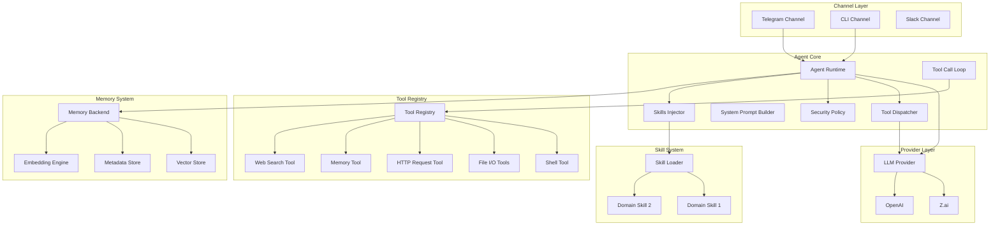

# ZeroClaw Migration Plan for Nergal

> Plan for migrating the current simplified Nergal bot architecture to ZeroClaw's trait-driven, modular AI agent runtime.

---

## Current State Analysis

### Existing Components

| Component | Current Implementation | Status |
|-----------|----------------------|---------|
| **Dialog System** | `DialogManager` with simple context management | ✅ Functional but limited |
| **LLM Provider** | `BaseLLMProvider` (llm_lib) | ✅ Good abstraction |
| **Web Search** | `BaseSearchProvider` (web_search_lib) | ✅ Works as MCP integration |
| **STT Provider** | `BaseSTTProvider` (stt_lib) | ✅ Works for voice messages |
| **Channel** | Hardcoded Telegram via python-telegram-bot | ⚠️ Tight coupling |
| **Tool System** | ❌ Non-existent | ❌ Missing |
| **Skill System** | ❌ Non-existent | ❌ Missing |
| **Memory/RAG** | ❌ Removed (was minimally implemented) | ❌ Missing |
| **Security** | ❌ Non-existent | ❌ Missing |
| **DI Container** | `dependency-injector` based | ✅ Good foundation |

### Limitations

1. **No Tool Execution** - Bot cannot run code, read files, make HTTP requests
2. **No Skill System** - Domain-specific capabilities require code changes
3. **No Memory** - No persistent context storage or retrieval
4. **Tight Coupling** - Telegram logic mixed with core logic
5. **No Security** - No approval system for dangerous actions
6. **No Parallel Execution** - Everything is sequential

---

## Target Architecture (ZeroClaw)

### Core Components



---

## Migration Phases

### Phase 1: Foundation (Week 1-2)

**Goal**: Create core abstractions without breaking existing functionality.

#### 1.1 Tool System Core

**Files to Create:**
```
src/nergal/tools/
├── __init__.py
├── base.py           # Tool interface and base classes
├── registry.py       # Tool registry and factory
└── exceptions.py     # Tool-specific exceptions
```

**Interfaces:**

```python
# src/nergal/tools/base.py
from abc import ABC, abstractmethod
from dataclasses import dataclass
from typing import Any

@dataclass
class ToolResult:
    """Result of tool execution."""
    success: bool
    output: str
    error: str | None = None
    metadata: dict[str, Any] | None = None


class Tool(ABC):
    """Base interface for all tools."""

    @property
    @abstractmethod
    def name(self) -> str:
        """Unique tool identifier."""
        pass

    @property
    @abstractmethod
    def description(self) -> str:
        """Human-readable description for LLM."""
        pass

    @property
    @abstractmethod
    def parameters_schema(self) -> dict[str, Any]:
        """JSON schema for tool parameters."""
        pass

    @abstractmethod
    async def execute(self, args: dict[str, Any]) -> ToolResult:
        """Execute the tool with given arguments."""
        pass
```

**Deliverables:**
- [ ] Tool base interface
- [ ] ToolResult dataclass
- [ ] ToolRegistry class for managing available tools
- [ ] `get_tool()` factory function
- [ ] Unit tests for tool registry

#### 1.2 Tool Dispatcher

**Files to Create:**
```
src/nergal/dispatcher/
├── __init__.py
├── base.py           # Dispatcher interface
├── native.py         # Native tool dispatcher
└── xml.py            # XML tool dispatcher
```

**Interfaces:**

```python
# src/nergal/dispatcher/base.py
from dataclasses import dataclass
from typing import TYPE_CHECKING

if TYPE_CHECKING:
    from nergal.tools.base import Tool

@dataclass
class ParsedToolCall:
    """Parsed tool call from LLM response."""
    name: str
    arguments: dict[str, Any]
    tool_call_id: str | None = None


class ToolDispatcher(ABC):
    """Bridge between LLM responses and tool execution."""

    @abstractmethod
    def parse_response(self, response: ChatResponse) -> tuple[str, list[ParsedToolCall]]:
        """Parse LLM response, extract text and tool calls."""
        pass

    @abstractmethod
    def format_results(self, results: list[ToolExecutionResult]) -> str:
        """Format tool results for next LLM call."""
        pass

    @abstractmethod
    def prompt_instructions(self, tools: list[Tool]) -> str:
        """Generate instructions for using tools."""
        pass

    @abstractmethod
    def should_send_tool_specs(self) -> bool:
        """Whether to send tool specs to LLM."""
        pass
```

**Deliverables:**
- [ ] ToolDispatcher interface
- [ ] NativeToolDispatcher implementation
- [ ] XmlToolDispatcher implementation
- [ ] Auto-detection based on provider capabilities

#### 1.3 Tool Call Loop

**Files to Create:**
```
src/nergal/agent/
├── __init__.py
└── loop.py            # Tool call loop implementation
```

**Implementation:**

```python
# src/nergal/agent/loop.py
async def run_tool_call_loop(
    provider: BaseLLMProvider,
    tools: list[Tool],
    dispatcher: ToolDispatcher,
    max_iterations: int = 10,
) -> str:
    """Run agentic tool call loop until completion."""
    history = []

    for iteration in range(max_iterations):
        # 1. Call LLM
        response = await _call_llm(provider, history, tools, dispatcher)

        # 2. Parse response
        text, calls = dispatcher.parse_response(response)

        # 3. If no tool calls, return response
        if not calls:
            return text

        # 4. Execute tools (parallel or sequential)
        results = await _execute_tools(tools, calls)

        # 5. Format and append results
        formatted = dispatcher.format_results(results)
        history.append(formatted)
```

**Deliverables:**
- [ ] Core tool call loop
- [ ] Parallel tool execution support
- [ ] Max iteration enforcement
- [ ] Error handling and recovery

---

### Phase 2: Basic Tools (Week 2-3)

**Goal**: Implement essential tools for basic functionality.

#### 2.1 File System Tools

**Files to Create:**
```
src/nergal/tools/files/
├── __init__.py
├── read.py           # File read tool
└── write.py          # File write tool
```

**Features:**
- Read file from configured workspace directory
- Write file to configured workspace directory
- Path validation (prevent directory traversal)
- Security policy enforcement

#### 2.2 HTTP Request Tool

**Files to Create:**
```
src/nergal/tools/http/
├── __init__.py
└── request.py        # HTTP request tool
```

**Features:**
- GET/POST/PUT/DELETE methods
- Configurable timeout
- Allowed domain filtering
- Response size limiting

#### 2.3 Shell Tool

**Files to Create:**
```
src/nergal/tools/shell/
├── __init__.py
└── execute.py        # Shell command tool
```

**Features:**
- Command execution in subprocess
- Configurable allowed commands whitelist
- Timeout enforcement
- Output size limiting

#### 2.4 Web Search Tool Wrapper

**Files to Create:**
```
src/nergal/tools/search/
├── __init__.py
└── web.py            # Web search wrapper for existing provider
```

**Features:**
- Wrapper around existing `web_search_lib`
- Convert to Tool interface
- Rate limiting

**Deliverables:**
- [ ] FileReadTool
- [ ] FileWriteTool
- [ ] HttpRequestTool
- [ ] ShellTool
- [ ] WebSearchTool (wrapper)
- [ ] Security policy integration for all tools
- [ ] Configuration for workspace directory and allowed commands

---

### Phase 3: Memory System (Week 3-4)

**Goal**: Implement persistent memory with RAG capabilities.

**Files to Create:**
```
src/nergal/memory/
├── __init__.py
├── base.py           # Memory interface
├── sqlite.py         # SQLite backend
├── chunker.py        # Text chunking
└── rag.py           # RAG context builder
```

**Architecture:**

```python
# src/nergal/memory/base.py
from abc import ABC, abstractmethod
from dataclasses import dataclass
from enum import Enum
from datetime import datetime

class MemoryCategory(Enum):
    """Memory entry categories."""
    CONVERSATION = "conversation"
    KNOWLEDGE = "knowledge"
    USER = "user"
    SYSTEM = "system"


@dataclass
class MemoryEntry:
    """Single memory entry."""
    key: str
    content: str
    category: MemoryCategory
    score: float | None = None
    created_at: datetime | None = None
    metadata: dict | None = None


class Memory(ABC):
    """Memory backend interface."""

    @abstractmethod
    async def store(
        self,
        key: str,
        content: str,
        category: MemoryCategory,
        metadata: dict | None = None,
    ) -> None:
        """Store a memory entry."""
        pass

    @abstractmethod
    async def recall(
        self,
        query: str,
        limit: int = 5,
        category: MemoryCategory | None = None,
    ) -> list[MemoryEntry]:
        """Recall relevant memory entries."""
        pass

    @abstractmethod
    async def forget(self, key: str) -> None:
        """Remove a memory entry."""
        pass
```

**Implementation Strategy:**
1. **SQLite Backend** - Use existing database infrastructure
2. **Simple Chunking** - Split text on paragraphs/sentences
3. **Hybrid Search** - BM25 + simple keyword matching
4. **Vector Store** - Optional, can use SQLite FTS5 for now

**Deliverables:**
- [ ] Memory interface
- [ ] SQLite implementation with FTS5
- [ ] Text chunker
- [ ] Hybrid search (keyword + FTS5)
- [ ] Memory tool for agent use
- [ ] RAG context builder for system prompt

---

### Phase 4: Security & Approval (Week 4)

**Goal**: Implement security controls and approval system.

**Files to Create:**
```
src/nergal/security/
├── __init__.py
├── policy.py         # Security policy
└── approval.py       # Approval manager
```

**Security Policy:**

```python
# src/nergal/security/policy.py
from enum import Enum
from pathlib import Path

class AutonomyLevel(Enum):
    """Agent autonomy levels."""
    READ_ONLY = "read_only"
    LIMITED = "limited"
    FULL = "full"


class SecurityPolicy:
    """Security policy for tool execution."""

    def __init__(
        self,
        autonomy_level: AutonomyLevel,
        workspace_dir: Path,
        allowed_commands: list[str] | None = None,
        workspace_only: bool = True,
    ) -> None:
        self.autonomy_level = autonomy_level
        self.workspace_dir = workspace_dir
        self.allowed_commands = allowed_commands or []
        self.workspace_only = workspace_only

    def is_tool_allowed(self, tool_name: str) -> bool:
        """Check if a tool can be used."""
        # Implement based on autonomy level
        pass

    def is_path_allowed(self, path: Path) -> bool:
        """Check if a path is within allowed bounds."""
        pass

    def is_command_allowed(self, command: str) -> bool:
        """Check if a command is allowed."""
        pass
```

**Approval Manager:**

```python
# src/nergal/security/approval.py
from dataclasses import dataclass

@dataclass
class ApprovalResponse:
    """Response to approval request."""
    approved: bool
    remember: bool = False


class ApprovalManager:
    """Manages approval requests for dangerous actions."""

    def requires_approval(self, tool_name: str) -> bool:
        """Check if an action needs approval."""
        pass

    async def request_approval(
        self,
        tool_name: str,
        arguments: dict,
    ) -> ApprovalResponse:
        """Request approval from user."""
        pass
```

**Deliverables:**
- [ ] SecurityPolicy class
- [ ] AutonomyLevel enum
- [ ] ApprovalManager class (no-op for now, channel integration later)
- [ ] Path validation
- [ ] Command whitelist support
- [ ] Integration with tool execution

---

### Phase 5: Skill System (Week 5)

**Goal**: Implement domain-specific skills.

**Files to Create:**
```
src/nergal/skills/
├── __init__.py
├── base.py           # Skill interface
├── loader.py         # Skill loader from files
└── prompt.py         # Skills prompt section
```

**Skill Structure:**

```
~/.nergal/skills/<skill-name>/
├── SKILL.md          # YAML manifest + prompts
└── scripts/          # Optional skill-specific scripts
```

**SKILL.md Format:**

```yaml
---
skill:
  name: deployment
  description: Handle deployment operations
  version: 1.0.0
  tags: [devops, deployment]

tools:
  - name: deploy_check
    description: Run pre-deployment checks
    kind: shell
    command: ./scripts/pre-deploy.sh

prompts:
  - "Always run smoke tests before deployment"
  - "Verify health checks after deployment"
---
```

**Implementation:**

```python
# src/nergal/skills/base.py
from dataclasses import dataclass
from pathlib import Path
from typing import Any

@dataclass
class Skill:
    """Domain-specific skill."""
    name: str
    description: str
    version: str
    tags: list[str]
    tools: list["SkillTool"]
    prompts: list[str]
    location: Path | None = None
```

**Deliverables:**
- [ ] Skill dataclass
- [ ] Skill loader from directory
- [ ] SKILL.md YAML parser
- [ ] Skill tools registration
- [ ] Skills prompt builder section
- [ ] Configuration for skills directory

---

### Phase 6: Channel Abstraction (Week 6)

**Goal**: Decouple Telegram from core logic.

**Files to Create:**
```
src/nergal/channels/
├── __init__.py
├── base.py           # Channel interface
├── telegram.py       # Telegram channel (extract existing)
└── factory.py        # Channel factory
```

**Channel Interface:**

```python
# src/nergal/channels/base.py
from abc import ABC, abstractmethod
from dataclasses import dataclass
from typing import Callable

@dataclass
class ChannelMessage:
    """Message received from channel."""
    id: str
    sender: str
    content: str
    channel: str
    timestamp: int
    metadata: dict


@dataclass
class SendMessage:
    """Message to send via channel."""
    content: str
    recipient: str
    reply_to: str | None = None
    metadata: dict | None = None


class Channel(ABC):
    """Abstraction for messaging platforms."""

    @property
    @abstractmethod
    def name(self) -> str:
        """Channel name."""
        pass

    @abstractmethod
    async def send(self, message: SendMessage) -> None:
        """Send a message."""
        pass

    @abstractmethod
    async def listen(self, handler: Callable[[ChannelMessage], None]) -> None:
        """Listen for incoming messages."""
        pass

    @abstractmethod
    async def request_approval(
        self,
        tool_name: str,
        arguments: dict,
    ) -> bool:
        """Request approval from user."""
        pass
```

**Migration Strategy:**
1. Extract existing Telegram logic into `TelegramChannel`
2. Implement `request_approval` using Telegram inline keyboards
3. Keep existing handler structure but move into channel

**Deliverables:**
- [ ] Channel interface
- [ ] TelegramChannel implementation
- [ ] Channel factory
- [ ] Approval flow via inline keyboards
- [ ] Message type handling (text, voice, etc.)

---

### Phase 7: Integration (Week 7)

**Goal**: Integrate all components into cohesive agent.

**Files to Modify:**
```
src/nergal/dialog/
└── manager.py        # Update to use agent runtime
```

**New Agent Runtime:**

```python
# src/nergal/agent/runtime.py
class AgentRuntime:
    """Main agent runtime that orchestrates all components."""

    def __init__(
        self,
        provider: BaseLLMProvider,
        tools: list[Tool],
        memory: Memory,
        security: SecurityPolicy,
        skills: list[Skill],
        max_history: int = 20,
    ) -> None:
        self.provider = provider
        self.tools = tools
        self.memory = memory
        self.security = security
        self.skills = skills
        self.max_history = max_history

    async def process_message(
        self,
        user_id: int,
        message: str,
    ) -> str:
        """Process message with full agent capabilities."""
        # 1. Get relevant memory
        context = await self.memory.recall(message, limit=3)

        # 2. Build system prompt
        system_prompt = self._build_system_prompt(context)

        # 3. Run tool call loop
        response = await run_tool_call_loop(
            provider=self.provider,
            tools=self.tools,
            dispatcher=self._get_dispatcher(),
            system_prompt=system_prompt,
        )

        # 4. Store in memory
        await self.memory.store(
            key=f"{user_id}_{int(time.time())}",
            content=message,
            category=MemoryCategory.CONVERSATION,
        )

        return response
```

**Deliverables:**
- [ ] AgentRuntime class
- [ ] Integration with DialogManager
- [ ] Memory context injection
- [ ] Skills prompt injection
- [ ] Tool registry population
- [ ] Updated DI container

---

### Phase 8: Testing & Polish (Week 8)

**Goal**: Comprehensive testing and documentation.

**Files to Create:**
```
tests/unit/tools/
├── test_base.py
├── test_file_read.py
├── test_shell.py
└── ...

tests/unit/dispatcher/
├── test_native.py
└── test_xml.py

tests/integration/agent/
└── test_runtime.py
```

**Deliverables:**
- [ ] Unit tests for all tools
- [ ] Unit tests for dispatcher
- [ ] Integration tests for agent runtime
- [ ] Documentation for tool development
- [ ] Documentation for skill development
- [ ] Migration guide for existing code
- [ ] Example skills

---

## Configuration Changes

### New Settings

```python
# src/nergal/config.py additions

class ToolSettings(BaseSettings):
    """Tool system settings."""
    model_config = SettingsConfigDict(env_prefix="TOOLS_")

    workspace_dir: str = Field(
        default="~/.nergal/workspace",
        description="Directory for file operations",
    )
    shell_enabled: bool = Field(default=True)
    shell_allowed_commands: list[str] = Field(
        default=[],
        description="Allowlist for shell commands",
    )
    http_allowed_domains: list[str] = Field(
        default=[],
        description="Allowlist for HTTP requests",
    )
    max_http_timeout: float = Field(default=30.0)


class MemorySettings(BaseSettings):
    """Memory system settings."""
    model_config = SettingsConfigDict(env_prefix="MEMORY_")

    enabled: bool = Field(default=True)
    backend: str = Field(default="sqlite")
    max_results: int = Field(default=5)
    chunk_size: int = Field(default=500)


class SecuritySettings(BaseSettings):
    """Security settings."""
    model_config = SettingsConfigDict(env_prefix="SECURITY_")

    autonomy_level: str = Field(
        default="limited",
        description="Autonomy level: read_only, limited, full",
    )
    workspace_only: bool = Field(
        default=True,
        description="Restrict file access to workspace",
    )
    max_actions_per_hour: int = Field(default=100)


class Settings(BaseSettings):
    # ... existing settings ...

    tools: ToolSettings = Field(default_factory=ToolSettings)
    memory: MemorySettings = Field(default_factory=MemorySettings)
    security: SecuritySettings = Field(default_factory=SecuritySettings)
```

---

## Dependency Updates

### New Dependencies

```toml
# pyproject.toml additions
dependencies = [
    # ... existing ...
    "aiosqlite>=0.19.0",      # For memory backend
    "pyyaml>=6.0",              # For skill manifests
    "fnmatch2>=0.1.0",         # For command filtering
]
```

---

## File Structure After Migration

```
src/nergal/
├── __init__.py
├── main.py
├── config.py
├── container.py
│
├── agent/                    # New
│   ├── __init__.py
│   ├── runtime.py            # Main agent orchestrator
│   └── loop.py              # Tool call loop
│
├── channels/                 # New
│   ├── __init__.py
│   ├── base.py              # Channel interface
│   ├── telegram.py          # Telegram implementation
│   └── factory.py          # Channel factory
│
├── tools/                   # New
│   ├── __init__.py
│   ├── base.py              # Tool interface
│   ├── registry.py          # Tool registry
│   ├── files/
│   │   ├── read.py
│   │   └── write.py
│   ├── shell/
│   │   └── execute.py
│   ├── http/
│   │   └── request.py
│   └── search/
│       └── web.py
│
├── dispatcher/              # New
│   ├── __init__.py
│   ├── base.py              # Dispatcher interface
│   ├── native.py            # Native dispatcher
│   └── xml.py              # XML dispatcher
│
├── memory/                 # New
│   ├── __init__.py
│   ├── base.py              # Memory interface
│   ├── sqlite.py            # SQLite backend
│   ├── chunker.py          # Text chunking
│   └── rag.py              # RAG context builder
│
├── skills/                 # New
│   ├── __init__.py
│   ├── base.py              # Skill interface
│   ├── loader.py            # Skill loader
│   └── prompt.py            # Skills prompt section
│
├── security/               # New
│   ├── __init__.py
│   ├── policy.py            # Security policy
│   └── approval.py          # Approval manager
│
├── dialog/                 # Updated
│   ├── __init__.py
│   ├── manager.py           # Updated to use agent
│   ├── context.py
│   └── styles.py
│
└── llm/                   # Kept
    ├── __init__.py
    └── base.py

# Skills directory (workspace)
~/.nergal/skills/
├── deployment/
│   └── SKILL.md
├── code_review/
│   └── SKILL.md
└── ...

# Workspace directory
~/.nergal/workspace/
└── (user files)
```

---

## Backward Compatibility

### Migration Strategy

1. **Gradual Rollout**: New features behind feature flags
2. **Legacy Mode**: Keep `DialogManager` as-is with option to enable agent mode
3. **Configuration**: New settings have defaults that maintain current behavior

```python
# Settings for gradual migration
AGENT_MODE_ENABLED = False  # Default: legacy mode
USE_TOOL_LOOP = False      # Default: simple LLM call
ENABLE_MEMORY = False      # Default: no RAG
```

### Breaking Changes

1. **API Changes**: `DialogManager.process_message()` signature stays same
2. **Behavior Changes**: Tool execution is new capability (opt-in)
3. **Storage**: New database tables for memory system

---

## Testing Strategy

### Unit Tests

- **Tool Tests**: Mock provider, test execute() with various inputs
- **Dispatcher Tests**: Test parsing and formatting
- **Memory Tests**: Test storage and retrieval
- **Security Tests**: Test policy enforcement

### Integration Tests

- **Agent Runtime**: End-to-end with mock provider and tools
- **Channel Tests**: Test message flow through channels
- **Tool Execution**: Test real tool execution with security

### Manual Testing

1. **Basic Chat**: Verify normal conversation flow
2. **Tool Usage**: Test file operations, HTTP requests
3. **Skills**: Load and use custom skills
4. **Security**: Test approval flow for dangerous actions
5. **Memory**: Verify context retrieval across sessions

---

## Estimated Timeline

| Phase | Duration | Complexity | Risk |
|-------|-----------|------------|-------|
| Phase 1: Foundation | 2 weeks | Medium | Low |
| Phase 2: Basic Tools | 1-2 weeks | Low-Medium | Low |
| Phase 3: Memory System | 1-2 weeks | Medium-High | Medium |
| Phase 4: Security | 1 week | Low-Medium | Low |
| Phase 5: Skills | 1 week | Medium | Low |
| Phase 6: Channels | 1 week | Medium | Low |
| Phase 7: Integration | 1 week | High | Medium |
| Phase 8: Testing | 1 week | Low | Low |

**Total**: 9-11 weeks

---

## Success Criteria

### Functional Requirements

- [ ] Bot can execute tools (file I/O, HTTP, shell)
- [ ] Tool execution follows security policy
- [ ] Skills can be loaded from directory
- [ ] Memory provides relevant context
- [ ] Telegram channel implements approval flow
- [ ] LLM provider with native tool support works

### Non-Functional Requirements

- [ ] Tool execution is parallel where possible
- [ ] Memory queries complete within 100ms
- [ ] Tool execution times out appropriately
- [ ] No memory leaks in long-running sessions
- [ ] Code follows existing style guide

---

## Next Steps

1. **Review this plan** with team/stakeholders
2. **Create Phase 1 task tracking** in project management tool
3. **Set up feature flags** in configuration
4. **Start with Phase 1**: Tool system foundation
5. **Progress through phases** with testing at each step

---

*Version: 1.0*
*Created: 2025-02-28*
*Status: Draft*
